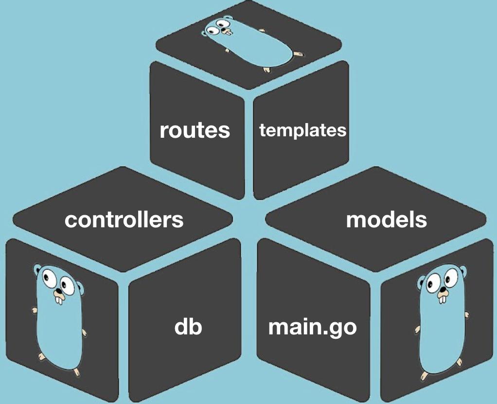
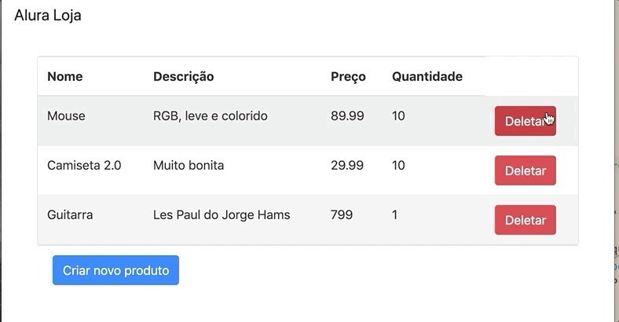
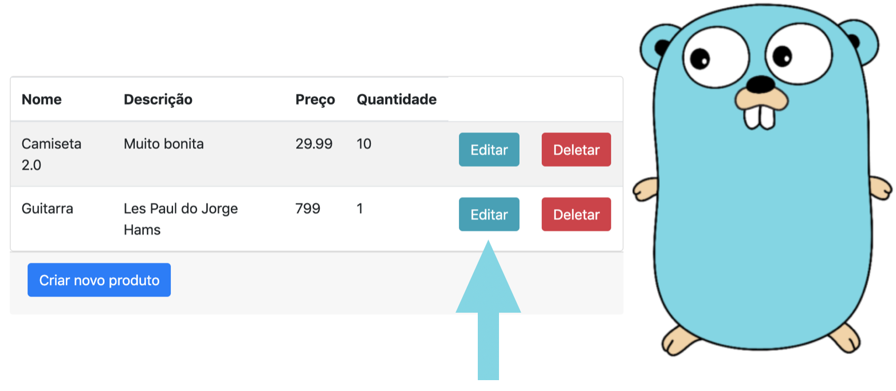

# Go: Fundamentos de uma aplicação web

## About

> `https://cursos.alura.com.br/course/go-lang-web`

Faça esse curso de GoLang e:

- Crie uma aplicação web do zero com Go dentro das principais convenções
- Aprenda o que são structs na prática
- Saiba como conectar sua aplicação Go com banco de dados
- Aprofunde seus conhecimentos na linguagem criada pelo Google
- Melhore seu código com partials

## Servidor e struct de produtos

### Introdução

[00:00] Olá meu nome é Guilherme Lima e eu serei seu instrutor neste curso de Desenvolver uma Aplicação Web com Go. Vamos desenvolver uma aplicação web onde eu vou ser capaz de criar produtos e salvar suas informações esses produtos no banco de dados.

[00:16] Então vou criar um produto tênis, vou falar que a uma descrição dele é “bom para corrida”, o preço dele vai ser 199, quantidade um. Eu posso salvar essa informação, esse produto que eu criei está lá no nosso banco de dados.

[00:30] Vamos ser capaz de editar esse produto, tem quantidade um, a quantidade 2 alteramos e seremos capazes de deletar também o nosso produto. “Tem certeza que remover esse produto?”, dou um ok e aquele produto sai.

[00:44] Vamos desenvolver tudo isso utilizando nenhum framework, apenas a linguagem Go, todas as nossas tabelas, nossos layouts, as nossas páginas HTML, os nossos códigos do servidor, vamos fazer utilizando a biblioteca padrão do Go.

[00:58] Vamos importar umas outras bibliotecas também para criar essas funcionalidades para nosso projeto, vamos modularizar nosso projeto na convenção do MVC.

[01:08] Então teremos uma rota, criar um arquivo para cuidar só das nossas rotas, quem atende essas rotas, quem vai atender essas novas requisições, criaremos uma pasta de controle onde cada função do nosso controle vai ter a responsabilidade que cabe ao controle.

[01:26] Quando precisarmos fazer acesso ao banco de dados vamos pedir para um modelo nosso, que faz a conexão com banco de dados e traz as informações importantes.

[01:37] Esse curso vamos dar continuidade nos ensinamentos, nos nossos conhecimentos da linguagem Go. Vamos lá!

### Workspace e pacotes

[00:00] Vamos iniciar nosso projeto. A primeira coisa que eu vou fazer vai ser abrir o Visual Studio Code que já configuramos, na atividade anterior. Vou apertar command J e acessa o terminal. Antes começar a criar todo nosso código, existe um local específico para armazenar toda nossa aplicação Go.

[00:20] Todo nosso código-fonte tem um local específico, existe uma convenção de onde deve colocar o nosso código Go. Vou acessar com cd $GOPATH - tudo maiúsculo, acessei do LS, Observe que eu tenho que uma pasta chamada Go.

[00:38] Eu vou acessar essa pasta cd go, eu tenho três diretórios – bin, pkg e o crc, vamos recordar o que que é cada diretório que fica armazenado: o diretório bin é referente aos arquivos binários, ou seja, onde ficam todos os arquivos executáveis das nossas aplicações feitas em Go.

[01:06] O diretório pkg é referente ao pacote – de package em inglês, o pacote contém objetos referentes a todos os pacotes que têm na nossa aplicação e esse src de source - na tradução em português de fonte, é onde armazena todo o código-fonte, todos os programas escritos em Go, sejam nossos ou de programas de pacotes de terceiros.

[01:33] Ficam sempre armazenados dentro dessa pasta src, ou seja, nessa pasta que criamos os nossos projetos, então vou acessar essa pasta src, dou um ls, tem dois diretórios, um GitHub e o Golang.

[01:48] O Golang é onde fica tudo para o funcionamento da nossa linguagem, tudo que vamos utilizar, e é onde fica armazenado todo o código-fonte das aplicações feitas em Go. Então cd github.com dou um ls e repara que já tenho pastas dentro.

[02:12] Essa pasta src, esse diretório fica também os pacotes de terceiros instalados no nosso sistema. Dentro dessa pasta eu vou criar um diretório que seja o nome do meu usuário do GitHub, por exemplo, e dentro desse diretório vou colocar todos os meus projetos feitos em Go.

[02:32] Nesse caso eu já tenho o meu usuário GitHub que é Alura, se você não tem, você pode colocar mkdir e o nome do seu usuário, por exemplo, meu nome é Guilherme, vou colocar Guilherme, dou um enter e ele vai criar uma pasta nesse diretório e dentro dessa pasta posso salvar os meus projetos.

[02:49] Como eu já tenho – se você não tem você cria o seu, eu vou acessar cd alura, na sua casa você coloca cd e o nome desse diretório que você criou; vou dar enter e se dou ls repara que eu não tenho nada nesse diretório.

[03:02] E aí que a nossa aplicação de fato vai começar, para ficar legal, para não ficar com muitos diretórios na aplicação, vou escrever code . vou dar enter e ele vai abrir novo Visual Studio Code dentro deste diretório.

[03:22] Repara que já estou até no diretório da Alura, vou fechar o de trás e vou abrir um diretório “grandão”, se der no terminar ls, não vai mostrar nada, porque não tem arquivo nenhum. Aqui nossa brincadeira, nossa grande caminhada começa.

[03:42] Quero criar uma loja que tenha vários produtos, quero conseguir visualizar vários produtos na minha loja, então, eu tenho o nome do produto, tem a descrição - uma descrição breve, preço e quantidade.

[03:58] Assim como se eu digito no Google o teu www.google.com eu caio num endereço, alguém consegue atender essa requisição. Digita o site da Alura, alura.com.br, eu caio no site da Alura.

[04:11] Eu quero fazer a mesma coisa só que da minha máquina, não vou colocar o meu projeto na web ainda; eu quero da minha máquina conseguir ver o que que as outras pessoas que vão acessar o site da minha loja verão.

[04:24] Quando nós queremos utilizar o nosso próprio computador para fazer teste na próxima máquina, utiliza o endereço local host nesse caso utilizo a porta 8000. Quando eu digito isso não tem nada, mas eu também não criei nenhuma página.

[04:42] Vou criar uma página. O nosso curso não tem o foco em páginas HTML, CSS e assim por diante, então se você tem interesse você pode fazer outros cursos na Alura em nossa formação de front end.

[04:57] Eu vou criar index.html para ser a página principal da aplicação, vou apertar command J para fechar aquele nosso terminal, em HTML vou selecionar a segunda opção para ele trazer algumas informações.

[05:13] Algumas coisas feitas em HTML, o título vou chamar de loja, no lugar de localhost vai ficar loja, vou colocar H1 e vou chamar de Alura loja.

[05:28] Depois eu coloco nossos produtos, quero conseguir visualizar isso, se eu atualizo minha página repare que não vai acontecer nada, porque ainda não subiu o servidor.

### Subindo o servidor

[00:00] Eu quero que a página quando eu digito localhost, na porta 8000 suba o nosso servidor, então vou criar um novo arquivo, ele vai ser o nosso código Go principal, por convenção chama de main.go.

[00:15] Não coloquei nada e ele já está com uma marcação vermelha, estou esperando saber de qual pacote é todo esse código que você vai criar, do próprio Gol e precisa especificar qual é o pacote que nós estamos querendo.

[00:32] É referente a qual pacote aquele código pertence? Pertence ao pacote Main. Eu vou criar uma função, chamá-la de main e dentro dessa função mesmo eu quero subir um servidor, quero que alguém consiga ouvir uma requisição e responder essa requisição.

[00:52] Então para conseguir vou colocar aqui http.ListenAndServe tem alguém que que é capaz de ouvir e responder essa nossa requisição, ou seja, ouça e sirva essa requisição, vou colocar na porta “8000”, e eu não preciso passar nenhuma informação para essa nossa requisição.

[01:15] Vou colocar como New, vou salvar, ele já importou a biblioteca que pertence esse http, se eu volto e atualiza não acontece nada, vou executar esse programa, vou dar “Control + L” para limpar, um LS que tem aqui index.html e vou executar esse Go.

[01:40] Vou falar, “Go executa go run main.go”, quando executa repara que no meu terminal ficou travado, vou atualizar a página, ele falou 404 - página não encontrada. Subimos o servidor, mas onde referenciamos que essa nossa página index precisa ser respondida?

[02:08] Não fizemos isso, então eu vou destravar, interromper o servidor com “control + C”, eu trago o servidor, vou diminuir para visualizar melhor, deixar maior nossa fonte. Deu um erro de 404, eu não encontrei essa página; precisa vincular essa página.

[02:36] As páginas em um projeto Go chama de template, quer dizer que essa página é um template que é possível de carregar dentro do Go. A primeira coisa que eu vou fazer no nosso projeto não teremos apenas uma página e sim algumas páginas.

[02:55] Se deixar todas as páginas vai ficar um pouco bagunçado, se eu tenho uma página e o main.go, se eu tiver duas páginas, três, quatro, trinta, vai ficar difícil de encontrar a página.

[03:11] Para organizar o nosso projeto de uma forma melhor, eu vou criar uma pasta e vou chamar de templates e vou colocar todos os nossos arquivos HTML Vou criar uma variável que vai conseguir trazer todos os meus templates desse nosso diretório.

[03:37] Eu vou chamar templates de var temp. Todos os meus templates estarão armazenados dentro dessa variável, eu preciso conseguir trazer todos eles para que eles sejam executados; para que a pessoa quando acessar a nossa página consiga visualizar o nosso template.

[04:08] Tem uma função que faz isso, consegue visualizar, a função pertence ao pacote template e se chama must; o must encapsula todos os templates e devolve dois retornos.

[04:32] Ele vai devolver o template e uma mensagem de erro, se não tiver erro conseguimos carregar. Se ele não conseguiu trazer algum ele vai trazer a mensagem de erro.

[04:44] Temos o template, já encapsulamos todos eles, mas onde eles estão? Para isso utilizamos mais uma função chamada template Parse Glob, vou passar o caminho de onde estão todos nossos templates que é na pasta templates.

[05:15] Eu quero carregar na pasta todos os templates template.Must(template.ParseGlob(“templates/*.html”), tudo que tiver .html eu quero trazer para minha variável.

[05:29] Eu coloquei o símbolo do asterisco, se que tiver tudo que tiver .html ele vai trazer para mim e vai renderizar como um template, agora eu consegui de fato atender uma requisição e encaminhar, para encaminhar para minha página index eu preciso chamar novamente a pasta http.

[05:51] Temos uma função chamada HandleFunc, ela trouxe a documentação dela e o primeiro parâmetro que ela espera é “qual é o caminho que você quer atender?”. Qual é a requisição que você quer atender, eu quero atender a requisição de barra.

[06:10] Sempre que tiver barra eu quero que alguém consiga atender a requisição, vamos criar uma função para atender. Vou chamar essa função de index. Toda vez que tiver uma requisição com barra essa nossa função vai mandar para o index.

[06:29] Vou criar uma função index, ela vai precisar de dois parâmetros: o primeiro Response Writer que por convenção chama w http.ResponseWriter – ou seja toda vez que tiver uma requisição eu quero conseguir escrever, mostrar para a pessoa que vai mexer no site quem vai responder.

[07:10] Segundo parâmetro vamos criar apontando para http request, sempre que tiver uma requisição vai ter esses dois parâmetros, que na verdade nas outras requisições também vão ser necessários.

[07:30] Carregou todos os templates, falou toda vez que tiver uma requisição para barra quem vai atender vai ser index. Queremos de fato executar o nosso template de index, então vou chamar de temp.ExecuteTemplate; cuidado com as letras maiúsculas e minúsculas.

[07:45] Vou passar parâmetro para essa função para de fato executar o nosso template, vou passar quem consegue passar a nossa resposta que é o nosso w; nosso responsewriter, vai passar também quem ele vai exibir, mostrar, o index.

[08:19] E por último quer passar alguma informação para nossa página index. Vou salvar e ele já trouxe o http. Parece que está tudo certinho para dar um Command J para conseguir visualizar, vou limpar meu terminal, veremos muito nesse curso.

[08:51] Colocar na pasta certinho, eu tenho main e template. Vou executar o main e pedir para o go run – roda o arquivo main.go. Ele ficou travado, legal. Vou atualizar, ele não mostrou nenhuma mensagem, não tem nada na verdade para conseguir executar.

[09:12] Estranho. Por que não estamos conseguindo ver o index.html? Para conseguir executar esse index precisa embedar um código HTML, temos nosso código html funciona da mesma forma existe um código Go ali dentro também que consegue fazer associação de tudo que HTML para conversar com o Go também.

[09:46] Vou pegar o index.html vou colocar duas chaves, vou definir que isso vai ser o meu index, então {{define “Index”}}, lá no final eu vou colocar mais duas chaves e vou escrever {{end}}, acaba nosso index.

[10:10] Vou salvar esse arquivo, o index vou deixar o I maiúsculo, salvei dos dois lados, eu passei o Index maiúsculo e referente ao Index maiúsculo, vou parar meu servidor “Control + C” e vou executar de novo com run.

[10:34] Ele atualizou a página. Vamos ver, apareceu lá o Alura loja, legal, só que eu não quero exibir apenas Alura loja, eu quero exibir alguns produtos na minha loja, então rapidamente eu vou criar um table.

[10:47] Dentro dessa table eu vou ter umathread para ficar bonito, dentro dela eu vou ter uma linha tr e dentro dessa tr eu quero ter para cada produto um nome, uma descrição, preço, quantidade.

[11:08] Então vou colocar th vezes quatro, eu quero quatro ths, um nome, uma descrição, preço e para finalizar eu quero uma quantidade. Criei a minha thread, vou criar agora o tbody – o corpo da minha tabela.

[11:36] Dentro do corpo eu vou ter tr que vai ser o meu primeiro produto e dentro desse tr vou ter quatro td, td*4, deixei aberto, agora sim bem melhor, o produto que vou criar vai ser uma camiseta.

[05:29] Eu gosto bastante de camiseta, vou colocar uma camiseta “bem bonita” que é a descrição, o preço dela vai ser 29 reais e a quantidade vou falar que eu tenho 10; vou criar mais um produto, último produtos tr.

[12:10] Eu tenho td vezes quatro, os quatro campos, vou criar o meu próximo produto vai ser um notebook “muito rápido”, o preço dele é 1999 e eu tenho só 2 em estoque, salvei, Command J.

[12:33] Voltei para o terminal, vou parar aplicação “Control + C”, vou limpar “Control + L”, rodei de novo, quando volto para página e atualizo eu tenho os produtos, está estranho o visual, mas consegui criar uma página HTML.

[12:56] Vincular a página HTML junto com o nosso código Go e tem aqui o nosso servidor Go funcionando.

### Adicionando o bootstrap

Vamos melhorar o visual da nossa aplicação?

Para isso, vamos adicionar o [bootstrap via CDN](https://getbootstrap.com/docs/4.3/getting-started/download/) e utilizar este incrível framework web com código-fonte aberto para desenvolvimento de componentes de interface e melhorar nosso front-end.

- Altere o conteúdo do arquivo index.html, substituindo o código desenvolvido pelo conteúdo abaixo:

```html
{{define "Index"}}
<!DOCTYPE html>
<html lang="en">

<head>
    <meta charset="UTF-8">
    <meta name="viewport" content="width=device-width, initial-scale=1.0">
    <meta http-equiv="X-UA-Compatible" content="ie=edge">
    <link rel="stylesheet" href="https://stackpath.bootstrapcdn.com/bootstrap/4.3.1/css/bootstrap.min.css" integrity="sha384-ggOyR0iXCbMQv3Xipma34MD+dH/1fQ784/j6cY/iJTQUOhcWr7x9JvoRxT2MZw1T"
        crossorigin="anonymous">
    <script src="https://stackpath.bootstrapcdn.com/bootstrap/4.3.1/js/bootstrap.min.js" integrity="sha384-JjSmVgyd0p3pXB1rRibZUAYoIIy6OrQ6VrjIEaFf/nJGzIxFDsf4x0xIM+B07jRM"
        crossorigin="anonymous"></script>
    <title>Alura loja</title>
</head>
<nav class="navbar navbar-light bg-light mb-4">
    <a class="navbar-brand" href="/">Alura Loja</a>
</nav>

<body>
    <div class="container">
        <section class="card">
            <div>
                <table class="table table-striped table-hover mb-0">
                    <thead>
                        <tr>
                            <th>Nome</th>
                            <th>Descrição</th>
                            <th>Preço</th>
                            <th>Quantidade</th>
                        </tr>
                    </thead>
                    <tbody>
                        <tr>
                            <td>Camiseta</td>
                            <td>Bem bonita</td>
                            <td>29</td>
                            <td>10</td>
                        </tr>
                        <tr>
                            <td>Notebook</td>
                            <td>Muito rápido</td>
                            <td>1999</td>
                            <td>2</td>
                        </tr>
                    </tbody>
                </table>
            </div>
        </section>

    </div>
</body>

</html>
{{end}}
```

### Criando struct de produtos

[00:00] Na atividade anterior, melhoramos o visual do site, adicionando Bootstrap, vamos ver como ficou. Vamos só ver como é que ficou, subiu o nosso servidor com Go run. Alura loja,

[00:19] Só que tem algo interessante, um ponto que podemos melhorar no nosso código que é o seguinte. Sempre que eu quero criar um produto novo eu vou lá no HTML, cria uma linha, uma nova tr, depois cria 4 tds, onde a primeira é referente ao nome, a descrição, preço e a quantidade.

[00:35] Seguindo essa ordem. Repara que está um pouco difícil para eu criar os meus produtos têm que mexer direto no código HTML. Se eu quiser criar outro produto de novo mais uma td, mais tr, mais quatro tds.

[00:46] Não está legal isso, será que existe uma forma da melhorar a criação dos nossos produtos? E a resposta é sim. Podemos criar uma estrutura, modelo de produtos onde cada produto já sabemos quais são os campos deles, tem o nome, descrição, preço e quantidade.

[01:03] Isso que vamos fazer agora, criar uma estrutura lá no nosso código principal, na nossa main para eu criar uma estrutura que utiliza a palavrinha do Go struct, struct é simplesmente uma coleção de variáveis que formam o novo tipo, quero criar um tipo e vai usar também essa palavrinha do Go.

[01:31] Como é o nome desse tipo de produto? Uma estrutura de produto, abre chaves e fecha chaves. Vamos criar a nossa estrutura de produto que vai ter um nome, o tipo dele, é uma string, a descrição também uma string.

[02:06] Também tem um preço que vai ser float 64 e temos uma quantidade, essa quantidade é 20. Criamos novo tipo, uma estrutura nova - essa estrutura tem o nome, descrição, preço, quantidade, todo esse conjunto de variáveis chama de produto.

[02:35] Agora eu quero de fato criar o meu tipo de produto, criar produtos utilizando este modelo, essa estrutura e vamos fazer agora, para os meus produtos eu não quero criar simplesmente criar um produto, eu quero uma lista de produtos.

[02:52] Eu quero no Go um slice de produtos, eu quero escrever produtos := vou atribuindo nessa variável uma lista. Vou colocar a colchetes, uma lista de produto e todos os produtos estarão dentro dessa chave.

[03:18] Eu vou criar o meu primeiro produto criando uma chave. Vamos ver duas formas de criar os nossos produtos, eu posso criar assim nome:, camiseta, tem também a descrição, que vou chamar : abre e fecha chaves – por quê?

[03:40] Chaves porque estou trabalhando com string, a descrição vai ser uma camiseta azul bonita, “bem bonita”, para ficar diferente daquela que já tinha. Preço da camiseta é um pouquinho mais caro, é 39.

[04:06] A quantidade dessa camiseta 5. Eu vou criar esse novo produto de uma forma diferente, eu passei os campos descrição, preço, quantidade, posso passar direto o conteúdo valor desse meu novo produto.

[04:28]. Então vai ser um tênis confortável ,duas strings, o preço dele vai ser 99, não está muito caro, está na promoção na loja 89 e a quantidade dele vai ser 3. Vou criar um produto e esse produto vai ser um fone, um fone “muito bom” e eu tenho o preço dele é 59.

[05:18] Eu tenho apenas dois. Eu cria minha lista de produtos, no final eu também coloco uma virgula, mesmo sendo nessa linha. Cria uma lista de produtos. Como que eu mando esses meus produtos para index.

[05:32] Eu não quero visualizar os produtos que estão lá no meu HTML direto, eu quero visualizar os produtos que eu acabei de instanciar na minha struct de produto, repara que no nosso método index está passando executa esse template do index.

[05:52] Ele vai responder, vai mostrar na tela, escrever na tela o que se define como nosso HTML e vai passar para ele de dado - não está passando nada, criou instancia de produto, mas não está passando esses valores.

[06:08] Eu vou fazer no lugar do nil eu vou passar os produtos, certo se eu fizer só isso vai funcionar? Vamos testar para ver. Eu salvei aparentemente certinho, eu vou parar o meu servidor e vou rodar o meu servidor mais uma vez. Vamos ver se vai visualizar produtos diferente.

[06:26] Não visualizou. Mas passou esses dados, passou para index, mas não está conseguindo ver. Em que momento que nós alteramos o conteúdo dela? Ou de onde que está de fato trazendo as propriedades da nossa lista de produtos para cá, não fizemos isso.

[06:51] Para começar vou minimizar o nosso terminal, vou remover esse primeiro e segundo produto, vou ficar só com um e vamos fazer um bem legal. Vamos fazer um range, vamos pegar cada listinha que criamos, cada produto e vai falar cada produto vai ser uma nova tr, quatro trs, uma td e quatro tds de forma dinâmica.

[07:13] Vou remover antes do nosso tbody tem o nosso thead; eu vou colocar um código Go. Coloquei duas chaves, vou escrever range e vou dar um ponto, porque eu quero trazer todos os valores, eu quero range de produtos na minha tela.

[07:38] No lugar de exibir o conteúdo camiseta, eu quero exibir o nome do produto que eu estou passando, esse nome é o nome da lista, eu removo o nome, incluo o código Go mais uma vez e coloco ponto, escrevo nome. Faça o mesmo para os outros também.

[07:57] Eu vou remover a descrição e vou colocar .descricao e fecho, sempre com duas chaves e utilizando o ponto; no preço remove, duas chaves, ponto preço e para finalizar a quantidade, mesmo procedimento.

[08:27] Antes de salvar precisa fechar, fala eu quero que você pegue cada produto da lista e coloca o produto um vai ser o nome, descrição, preço 1, quantidade 1, acabou esse produto.

[08:50] Vamos fechar essa nossa range, embaixo coloco a palavra end, para cada produto vai ter essa repetição, salvei, vou no meu main.go, vou ver o meu terminalzinho de novo, Command J.

[09:04] Comando “Control + C” para parar o terminal, “Control + L” para limpar, rodei de novo, agora vamos ver se funcionou mesmo. Vou atualizar, está lá. Camiseta azul bem bonita, o tênis confortável, fone muito bonito. Será que funciona mesmo? Vamos testar e criar mais um produto.

[09:21] No main.go eu quero criar um produto novo, coloco as chaves e vou colocar um nome engraçado para ver. Vai ser “Produto novo”, a descrição é muito legal, o preço dele está 1,99, e a quantidade dele eu tenho só um, é superpromoção.

[09:54] Salvei, vem no terminal, cancela meu terminal, derrubo, subo de novo, eu esqueci da virgula no final, não pode, vamos ver, rodei, voltei, vamos ver se aparece produto novo e apareceu o produto novo.

[10:12] Repara que está gerando uma tabela dinâmica de produtos agora, utilizando a struct.

### Faça como eu fiz na aula

**Sua vez!**

Vamos criar uma loja, com vários produtos diferentes, onde as pessoas podem acessar e ver uma lista com todos meus produtos e alguns detalhes deles, como o nome, descrição, preço e quantidade.

> Para iniciar o desenvolvimento da aplicação, crie um servidor com go e uma página html com uma tabela de produtos. Em seguida, deixe a tabela de produtos dinâmica por meio de instâncias de uma struct, com base no conteúdo visto nos vídeos.

**Resumo do código**

- Para criar o servidor e conseguir exibir uma página html, crie um arquivo main.go e utilize as funções HandleFunc e ListenAndServe do pacote http, conforme ilustra a imagem abaixo:
package main

```go
import (
    "html/template"
    "net/http"
)

var tmpl = template.Must(template.ParseGlob("templates/*.html"))

func main() {
    http.HandleFunc("/", Index)
    http.ListenAndServe(":8000", nil)
}
func Index(w http.ResponseWriter, r *http.Request) {
    tmpl.ExecuteTemplate(w, "Index", nil)
```

- Em seguida, crie uma pasta para armazenar a página html chamada templates e uma página index.html, definindo entre 2 chaves {{ }} a referência passada na função ExecuteTemplate.

```html
{{define "Index"}}
<!DOCTYPE html>

código omitido...

</html>
{{end}}
```

- Para organizar melhor a forma de exibir e manter nossos produtos, crie uma coleção de variáveis e formar um novo tipo chamado Produto através do prefixo type, seguido do nome e o sufixo struct:

```go
type Produto struct {
    Nome       string
    Descricao  string
    Preco      float64
    Quantidade int
}
```

- Construa um slice de produtos, com todos os produtos que queremos exibir na nossa página index.html:

```go
func index(w http.ResponseWriter, r *http.Request) {
    produtos := []Produto{
        {Nome: "Camiseta", Descricao: "Azul, bem bonita", Preco: 39, Quantidade: 5},
        {"Tenis", "Confortável", 89, 3},
        {"Fone", "Muito bom", 59, 2},
        {"Produto novo", "Muito legal", 1.99, 1},
    }

    temp.ExecuteTemplate(w, "Index", produtos)
}
```

- Para finalizar, altera o arquivo index.html para exibir todos os produtos de forma dinâmica:

```html
<tbody>
  {{range .}}
  <tr>
      <td>{{.Nome}}</td>
      <td>{{.Descricao}}</td>
      <td>{{.Preco}}</td>
      <td>{{.Quantidade}}</td>
  </tr>
  {{end}}
```

O gabarito deste exercício é o passo a passo demonstrado no vídeo. Tenha certeza de que tudo está certo antes de continuar.

### Um pouco mais sobre struct

Inicialmente, em nosso projeto, adicionamos os produtos direto no Html, criando uma nova tr e quatro td para representar, respectivamente: o nome, a descrição, o preço e a quantidade do produto.

Em seguida, criamos uma struct de Produto e tornamos nosso Html dinâmico, instanciando os produtos no arquivo main.go.

Sabendo disso, analise as afirmações abaixo e marque as verdadeiras.

- **Qualquer valor armazenado em uma struct, pode ser alterado.**
  - *Certo! As structs são tipos mutáveis, sendo assim, qualquer valor pode ser alterado. Para verificar um exemplo, você pode clicar no link a seguir para acessar The Go Playland.*
- **Uma struct é simplesmente uma coleção variáveis que formam um novo tipo.**
  - *Certo! No nosso exemplo, a struct de Produto possui 4 variáveis: nome e descrição do tipo string, preço do tipo float64 e quantidade do tipo inteiro.*
- **Podemos criar a instância de uma struct utilizando as chaves {} e, dentro delas, os valor dos campos na ordem que foram criados.**
  - *Certo! Diferente de outras linguagens de programação que utilizam os ( ) (parênteses), em Go, utilizamos { } (chaves).*
- Uma struct é simplesmente uma coleção variáveis do mesmo tipo que formam um novo tipo.

### O que aprendemos?

**Nessa aula:**

- Criamos o nosso projeto no workspace correto, dentro do GOPATH (dentro da pasta src, github.com, seguido do nome de usuário do Github);
- Aprendemos como subir um servidor através da função http.ListenAndServe(), exibindo uma tabela com nossos produtos;
- Em seguida criamos uma struct de Produto, onde instanciamos alguns produtos e exibimos de forma dinâmica em nossa index.html.

**Projeto desenvolvido nesta aula**

[Neste link](), você fará o download do projeto feito até esta aula.

Caso queira visualizar o código desenvolvido até aqui, [clique neste link](https://github.com/alura-cursos/web_com_golang).

**Na próxima aula**

Vamos instalar o Postgres para armazenar nossos produtos de forma segura, conectar nosso projeto e exibir os produtos que estão cadastrados no banco de dados!

## Conectando com banco de dados (33m)

### Instalando o Postgres

[00:00] Vamos exibindo os produtos de forma dinâmica, porém existe um ponto muito sensível no projeto, todos os produtos estão cadastrados no arquivo main.go. Vamos no terminal e conseguimos ver a camiseta, fone e o produto novo.

[00:21] Se eu removo a linha “Produto novo” no nosso código, meu produto novo vai simplesmente desaparecer. Observa que todos os dados da nossa aplicação que são o que temos de mais importante, são os nossos produtos, eles estão no arquivo chamado no ponto Go.

[00:45] Podemos perder muito fácil os nossos dados, será que existe alguma forma melhorar os nossos dados, deixá-los mais seguros, existe, pode usar um banco de dados SQL.

[00:57] Depois mostra os nossos produtos no Go, conecta o nosso projeto com o banco de dados SQL, pode ser o postgre, por exemplo, e tem os nossos produtos guardados, seguros, vamos fazer isso.

[01:15] Primeira coisa, eu vou abrir aqui o postgre, clique em download, depois baseado no sistema operacional que você estiver utilizando clica no Windows ou Mac, ou no Linux - no meu caso vou usar o Mac versão enterprise para aprender também, ver como que mexe.

[01:37] Na versão 11.4 do post repara que ele não tem suporte ainda para o Linux, a versão 10.9 tem e essa que vai usar o nosso projeto, a versão 11.4 roda no Mac e no Windows 64, mas não roda no Windows 32.

[01:52] Para deixar o nosso projeto de forma que todas as pessoas possam utilizar, ter como base nossos cursos, vou fazer download da versão 10.9, clicando em download se for Mac no seu caso, se for Windows 64, Windows 32 ou se for Linux. Para ganhar tempo já fiz o download, dá um pause no vídeo e pode continuar depois junto comigo.

[02:17] Dando continuidade eu vou clicar no postgre para fazer a instalação, abrir, instalador do postgre, na minha máquina, vou dar um duplo clique para executar este instalador, ele falou isso aqui você baixou da internet tem certeza que você quer abrir? Pode abrir, pediu a senha para instalar os programas no Mac, digita a senha do meu administrador.

[02:39] Ele vai começar abrir aqui o instalador do postgre, está abrindo, next duas vezes, quero instalar esses componentes, um ponto importante, a senha, é essa senha ela é extremamente importante porque vou precisar dela para conseguir conectar com o banco de dados depois.

[03:05] Escrevam uma senha que vocês vão lembrar depois, vou usar a porta padrão 5432, vou deixar default, bloqueio também, next três vezes, ele vai começar a instalação do postgre. Terminou a instalação, perguntou se quer stack builder vou falar que não.

[03:34] Vou desmarcar a opção e clico em terminar, vou fechar essa janela, agora que terminamos, vou apertar o comando de espaço e vou digitar PG e ele já mostra PGAdmin4, se você tiver no Linux ou Windows vai no iniciar e vai aparecer o ícone do tipo novos programas instalados.

[03:57] Eu vou clicar enter PGAdmin4. Eu dou enter e ele está carregando, criando uma porta, novo servidor, apareceu o elefante que é o símbolo do postgre, está carregando, vamos ver, ele abriu.

[04:21] Ele pede para que consiga entrar digitar nossa senha de conexão com banco de dados, vou digitar a senha, consegui acessar a minha base de dados, vou clicar em servers - que são serviços, não quero que salve minha senha, eu tenho uma base de dados que postgre utilliza.

[04:42] Eu quero criar uma base de dados para guardar os produtos da nossa loja - que chamou de Alura loja, vou clicar com botão direito, create data, mês e vou criar uma nova base de dados e essa base de dados vai se chamar alura_loja.

[04:57] Vou clicar em save, repare que agora temos uma base de dados criada, temos Alura, a loja do postgre mesmo, vou acessar Alura loja, vou vir em esquema, em público não tem nenhuma tabela, não criamos uma tabela para armazenar os dados.

[05:19] Eu quero uma tabela que contenha os dados dos meus produtos - o nome, descrição, quantidade, para isso vou vir em tool e vou criar um Script SQL para inicializar a tabela.

[05:37] Create table, cria uma tabela, tabela chamada produtos, porque eu não vou armazenar um, vou armazenar vários produtos dentro dessa tabela. Entre parênteses eu vou colocar o código da minha tabela de produtos, o primeiro campo que vou criar é um identificador de produtos, ou seja, um ID.

[06:00] Cada produto que tiver na nossa tabela, vai ter um identificador único. Eu vou chamar de ID, eu quero que ele seja um serial - um autoincremento sempre cada produto, cada inserção - nome de produto, que fizer eu quero que ele tenha um valor sequencial.

[06:20] Vou falar que ele é primary key, um identificador único, através dele vai conseguir conectar com outras tabelas também, criei ID, com o produto também tem um nome que eu vou identificar como varchar, uma string do SQL.

[06:41] Tem a descrição que também é um varchar, tem o preço que vai chamar de decimal e tem também a quantidade que que é um inteiro integer, tem uma tabela, que tem uma descrição de uma quantidade; eu quero executar esse código SQL.

[07:11] Eu clico no raiozinho embaixo onde estava Alura loja, vamos ver o que ele falou, que eu esqueci de alguma coisa, é integer. Foi criada com sucesso. Será que ela aparece? Vou clicar com botão direito em cima dela e vou selecionar, roda e atualiza a tabela.

[07:44] Tem a tabela de produtos, só que eu não tenho nenhum produto na minha tabela, eu vou clicar com o botão direito e colocar que eu quero visualizar todas as linhas da minha tabela, vai aparecer, não tem nenhum produto.

[07:55] Queremos inserir os produtos na nossa base de dados, mais uma vez eu venho em query tool e vou criar a inserção dos meus produtos. Vou digitar insert into. É o comando para inserir e ele espera o nome da tabela.

[08:12] Vou falar insere na tabela de produtos, em quais campos? Quando vai utilizar um insert que não precisa especificar, vai remover o campo, quero que insira o nome no campo nome, descrição no campo descrição, preço no campo preço e valores values.

[08:44] Os valores eu vou colocar cada valor, eles vão representar um determinado produto, bem parecido com que fizemos na nossa struct, o primeiro produto que eu vou inserir ele vai ser uma camiseta.

[08:56] Um ponto importante no SQL vamos utilizar aspas simples. Então, uma camiseta, tem lá uma camiseta azul, essa uma camiseta preta, o preço dela vai ser 19 e a quantidade eu tenho 10 em estoque, vou colocar uma vírgula e vou criar um outro produto, fazer um outro insert, aspas simples.

[09:18] E vou chamar o próximo produto de fone, 'Fone', 'Muito bom', o preço dele é 99 e eu tenho cinco no estoque. Terminei de fazer as inserções, coloco ponto-e-virgula para ele entender que acaba essa inserção; executar.

[09:44] Ele falou querys executadas com sucesso, com o botão direito vou dar um refresh mais uma vez. Quero visualizar toda minha tabela, todas as colunas e consegui visualizar que tem os dois produtos. O próximo passo é conseguir conectar o banco de dados com a nossa aplicação Go. Veremos a seguir.

**NOTA PESSOAL**

- Docker containers:

```shell
docker network create --driver bridge go3web-network

docker container run --name go3web-postgres --network=go3web-network -e "POSTGRES_PASSWORD=Go3Web-Postgres" -p 5432:5432 -v /Data/Learn/aboutGo/Classes/AluClass/Go3Web/codes/data:/var/lib/postgresql/data -d postgres:10.20-alpine

docker container run --name go3web--pgadmin --network=go3web-network -p 15432:80 -e "PGADMIN_DEFAULT_EMAIL=tarsoqueiroz@gmail.com" -e "PGADMIN_DEFAULT_PASSWORD=Go3Web-PgAdmin" -d dpage/pgadmin4
```

- Connect to:

```shell
http://localhost:15432
```

- Credentials on PgAdmin:

```shell
Username: tarsoqueiroz@gmail.com
Password: Go3Web-PgAdmin
```

- Create connection to Server:

```shell
Name: Local
Host name: go3web-postgres
Port: 5432
Username: postgres
Password: Go3Web-Postgres
```

> *Ref:* `https://renatogroffe.medium.com/postgresql-docker-executando-uma-inst%C3%A2ncia-e-o-pgadmin-4-a-partir-de-containers-ad783e85b1a4`

- Create table

```sql
create table produtos (
	id serial primary key,
	nome varchar,
	descricao varchar,
	preco decimal,
	quantidade integer
)
```

- Insert products on table

```sql
insert into produtos (nome, descricao, preco, quantidade) values 
('Camiseta', 'Preta', 19, 10),
('Fone', 'Muito bom', 99, 5);
```

### Conectando com o banco

[00:00] Criamos dois produtos, a camiseta e o fone no postgre e queremos conectar com o nosso projeto feito em Go. Vamos no nosso Visual Studio Code e quero conectar o nosso projeto com postgre.

[00:13] Existe alguma biblioteca que facilite essa comunicação entre o postgre e o nosso projeto feito em Go? Existe um local onde pode pesquisar bibliotecas que outras pessoas fizeram e que pode utilizar também em nossos projetos.

[00:31] No Go.org, nesse caminho consegue pesquisar vários pacotes de conexão com banco e outras coisas também, quero pesquisar postgres, aparece “github.com/lib”, uma biblioteca feita em Go para conexão e é justamente o que precisa.

[01:10] A primeira coisa para conseguir utilizar a biblioteca é fazer a instalação dela faz através desse comandinho go get e github.com/lib/pq, vou copiar vou lá no nosso terminal e vou digitar, vou colar e ele vai trazer essa biblioteca para o nosso projeto, só esperar um pouquinho, pronto.

[01:36] Ele trouxe para o nosso terminal, vamos na documentação para ver como que está o passo-a-passo dessa biblioteca, tem que fazer agora para de fato colocar nesse nosso projeto é importar.

[01:50] Então vou copiar a linha _ “github.com/lib/pq” e vou colocar na lista de import, repara uma coisa interessante apareceu underline na frente, que significa esse underline na frente? Vou remover underline e vou salvar o projeto como esse e tudo sumiu.

[02:08] Vou dar “Control + Z” vou salvar de novo, porque o Visual Studio Code tira isso? Na verdade, não pode importar uma biblioteca e não utilizar, só que a biblioteca do postgre não vai utilizar o tempo inteiro, logo quando nosso programa iniciar vai usar durante o tempo de execução da nossa aplicação.

[02:31] Para isso utiliza esse underline na frente vou salvar e tem lá a nossa biblioteca agora incorporada no nosso projeto, onde vai utilizar durante o tempo de execução da nossa aplicação.

[02:48] Já tem a biblioteca quando faz a conexão com banco de dados, eu preciso de fato conectar com banco de dados. Eu não quero ficar nessa tela, eu quero conseguir fazer essa conexão com banco de dados.

[03:05] Vou criar uma nova função e essa função eu vou chamar de chamar de conecta com banco de dados, essa função devo ter um retorno que é um ponteiro para o SQL, eu vou colocar o retorno dessa função sql.db.

[03:35] Precisa passar as informações para essa função que conecta com banco, vou criar uma string de conexão, passando o nome do banco que está utilizando, o nome do usuário, a senha host que vai utilizar para essa nossa stringde conexão.

[03:58] Vou falar conexão ela vai ser := vai fazer uma atribuição e vou passar string para ela, vai ter que passar quem é usuário, depois o nome da tabela que está utilizando, dbname, depois vai pegar todos esses dados, a senha, o host e se está utilizando o modo SSL.

[04:34] Eu preciso passar todas as informações. Mas onde eu encontro essas informações? No nosso postgre de novo vou mostrar para vocês, eu vou clicar lá na nossa propriedade, vou clicar com botão direito em cima dele e tem properties

[04:57] Vou acessar e ele tem algumas informações, tem uma aba chamada conexão, tem as informações que precisa passar então o host name é localhost, vamos lá vai passar essa informação também, subir, vai ficar melhor.

[05:20] O nosso host eu vou passar que vai ser o nosso = localhost, a porta que está utilizando não vai precisar agora, tem user name que é o usuário, que está fazendo a conexão, então usuário é o postgres.

[05:45] Então, ”user=postgres”, o nome do banco de dados. Está fácil, o nome do banco que criamos, Alura loja. Vou pegar ”user=postgres dbname=alura_loja”, para finalizar a nossa senha, nesse momento do curso vai passar a senha direto, mas existe uma forma da conseguir passar essa senha para as variáveis de ambiente da nossa aplicação.

[06:16] Numa aplicação real, faria isso, como esse curso é um curso onde está vendo as principais funcionalidades, consolidando o nosso passo a passo, vai passar o nosso password direto e vocês vão descobrir agora a senha que eu utilizei para subir a minha aplicação.

[06:36] Passei a senha, para finalizar esse modo SSL, eu vou deixar como desabilitado, então, escrever disable, pronto, eu tenho a minha senha de conexão, agora eu quero de fato abrir uma conexão com o banco de dados.

[06:58] Para eu abrir essa conexão com banco de dados, eu vou criar duas variáveis db e uma variável de erro porque que eu estou utilizando essas duas variáveis: db e erro. Lembrando que as funções que utiliza no Go, geralmente nos devolvem um ou mais retornos.

[07:13] Nesse caso, essa função que utilizaremos para abrir conexão, ela devolve esses dois setores, então se conseguir fazer a conexão certa não vai ter nenhuma mensagem de erro. Vou chamar o SQL que é o nosso ponteiro ali em cima.

[07:33] Ele já trouxe algumas opções, eu vou usar sql.open, eu quero abrir uma conexão nova no banco de dados ”postgres”, isso em aspas duplas, eu vou passar a minha string de conexão - que é a conexão que essa variável que eu queria em cima passando essas informações.

[08:00] Vamos verificar se tem algum erro, se se eu recebi uma mensagem de erro, if err !=nil continuo a minha aplicação, senão vou dar panic, exibir qual é o erro. E passa essa função. Se deu tudo certo, se nada de mensagem de erro eu quero retornar.

[08:41] Eu quero retornar essa minha variável. Para finalizar vamos descobrir se a conexão deu certo ou não. Eu vou lá no meu código main, na minha função principal, eu vou abrir uma conexão e fechar conexão só para ver se não recebe nenhuma mensagem de erro.

[09:06] Vou chamar de ver: igual a essa nossa função que conecta com banco, conectar com banco de dados, depois eu quero fechar essa função, para fechar não posso usar um comando que é o defer db.Close.

[09:25] Vou salvar, vamos ver se está tudo certinho, beleza parece que está tudo certo, vamos derrubar a nossa aplicação, já está derrubado, executar go run main.go para subir o nosso servidor; executei, não recebemos nenhuma mensagem de erro.

[09:56] O que *defer faz: ele é executado depois que tudo tiver sido executado na nossa função. A última coisa que ele vai fazer depois de executar as linhas é isso, então ele abriu a conexão, executou tudo e depois fechou.

[10:12] Não recebemos nenhuma mensagem de erro, isso significa que conseguimos conectar com banco de dados. Então se consegue conectar, consegue buscar essas informações que estão no PGAdmin.

[10:28] Eu quero buscar as informações que estão no banco, a camiseta preta e o fone muito. Na próxima aula vai - agora que já tem a conexão - buscar essas informações do banco de dados.

### Exibindo dados do banco

[00:00] Conectamos o nosso projeto Go com o banco de dados postgres, queremos exibir os dados que estão lá no banco de dados, na nossa função index criávamos nosso slice de produtos, passava para nossa index, não é isso que quero fazer, quero trazer os valores que estão no banco.

[00:21] Eu vou conectar com banco, então db= conectaComBancoDeDados, assim que eu faço conexão eu preciso saber pedir para o banco de dados o que eu quero que ele me ele me traga, eu já tenho a conexão.

[00:38] eu tenho que falar banco eu quero que você me traga tudo relacionado ao produto, eu quero toda a tabela de produtos, vamos criar um select de produtos, de todos os produtos, ele vai ser =, essa função que vamos utilizar, big query, devolve dois retornos, select de todos os produtos que é o que esperamos.

[01:11] E uma mensagem de erro, é possível que não consiga trazer esses produtos, então ele traz esses dois erros, uma mensagem de erro, err:- db.Query, queremos executar uma query, pedir para o banco: “banco seleciona para mim” select.

[01:28] Deixar tudo minúsculo ”select * from produtos”, ou seja, traga tudo relacionado a produtos. Será que deu certo? Vamos verificar, se tiver uma mensagem se o erro não for nulo, existe um erro e eu quero exibir esse erro.

[01:51] Coloco um panic, coloco erro nulo, salvei, aparentemente não deu erro, então vai uma mensagem “o produto não passou ainda”, está tranquilo, já vai passar. Fizemos select em todos os produtos, não exibe todos os produtos, tem que fazer uma forma de conseguir verificar linha a linha o que cada produto representa.

[02:34] No postgres o ID 1 representa a camiseta e a descrição “preta”, o preço dele é 19 e a quantidade é 10; o produto dois, ID 2, nome dele é fone a descrição dele é muito bom, ou seja, linha a linha eu tenho que saber o que eu estou buscando.

[02:54] Eu vou criar um for para esse meu select, vou no Visual Studio Code e vou criar variável chamada de p, ela vai ser igual a instância de um produto apenas. Então vai ser um produto, trata-se de um produto, dentro dessa variável eu vou armazenar todo o conteúdo que estiver vindo do banco de dados.

[03:20] Cada produto do banco de dados vou chamar de p, assim que eu criar todos os meus produtos, eu vou inserir uma variável chamada produtos a nossa lista, nosso slice, passo ele embaixo.

[03:41] Vamos lá, para começar vou criar o for, linha a linha vai vendo o que cada produto é, for do select de produtos e usar uma função chamada next. Ou seja, eu quero a próximo à linha – leu a primeira eu quero a próxima linha, vou abrir parênteses, abro e fecho chaves também.

[04:06] Eu vou criar uma variável que eu vou chamar de id. Lembrando que essa variável precisa criar também no nosso modelo de produto, vou criar para não esquecer id.

[04:30] Assim, var id int depois eu tenho mais uma variável que vai ser o nome e eu tenho também a descrição que eles são uma string e a quantidade, para finalizar eu tenho preço que é float 64.

[05:02] Tenho todas essas variáveis. Vamos escanear linha a linha, var vou guardar isso numa variável de erro, ele vai ser igual a esse meu select de todos os produtos .scan. Eu vou escanear linha a linha.

[05:22] Você viu que eu criei essas variáveis de nome de quantidade, nome, descrição e preço dentro dessas variáveis que eu criei, eu quero que fique armazenado na memória do meu computador, no endereço de memória do meu computador o conteúdo dessas variáveis. Como é que eu faço isso?

[05:37] Eu vou colocar no scan um e comercial, vou escrever o id, depois eu quero na memória do meu computador dessas variáveis que eu acabei de criar - eu quero armazenar o nome, armazenar a descrição, também o preço e quero armazenar por último a quantidade.

[06:04] Tem conteúdo de todos eles, está numa mensagem de erro, pode ser que eu não consiga armazenar. Então vai Verificar também se tem um erro, se o erro não for nulo, faço panic erro, err.error, salvar, parece que está tudo certinho.

[06:29] Eu fiz o scan desse primeiro produto, eu preciso armazenar o conteúdo desse produto na minha variável, que instancia o produto, vou instanciar a variável, p.nome, ela vai ser igual ao nome que eu trouxe.

[06:54] Eu criei uma variável p e aos poucos eu vou atribuindo os valores dessa variável. Então o p.nome vai ser igual o nome que está armazenado na memória, de onde veio esse nome? Eu escaneei do meu banco de dados; o mesmo vou fazer para as nossas outras variáveis também.

[07:09] O p.descricao vai ser igual a descrição, preço vai ser igual ao preço e para finalizar o p.quantidade vai ser igual a quantidade, tudo isso só falta um último passo; eu tenho um produto p, eu criei produto, o que que vamos fazer? Passar esse produto para o meu array de produtos.

[07:36] Vou colocar p. vou falar produtos = append vou adicionar na minha lista de produtos e qual é o valor? Valor desse produto é individual. Vou salvar, vamos ver se está tudo certinho. Aparentemente parece está tudo certo.

[08:04] Depois que eu faço tudo isso, é muito importante: eu abri a conexão com o banco de dados, mas eu não fechei, eu preciso fechar conexão, como que fechou? Usou - depois que abre uma conexão, usou defer para fechar essa conexão.

[08:20] Não precisa dessas duas linhas para abrir e fechar a conexão com o programa, agora tem um momento, um lugar que vai de fato usar essa conexão, eu vou colocar embaixo, depois que fizer tudo, bota defer db.Close, eu quero fechar a conexão.

[08:41] A linha 67 vou deixar só para não perder a ideia. Abriu a conexão, fechou a conexão com banco de dados, agora vem a prova real. Temos a lista as lojas com os produtos que instanciamos manualmente.

[08:58] E tem os produtos do nosso banco de dados. Vamos em abrir para ficar emocionante. Tem a camiseta preta e o fone muito bom; eu vou subir o servidor e vai descobrir se deu certo.

[09:09] Vamos lá go run main.go, executei, aparentemente não recebemos nenhuma mensagem de erro, nenhum panic, vou voltar e atualizar a página, atualizei e tem camiseta preta, o fone muito bom –“Guilherme não sei não será que você não está me enrolando?”

[09:29] Vamos colocar um produto a mais no banco e vamos ver em tools, vou isso deu certo mesmo, vou colocar um produto, mas vou fazer inserção manual. Vou vir na loja na tabela, clica em tools, vou fazer inserção de um produto, então insert into na tabela produtos.

[09:58] Eu quero inserir o nome, descrição, o preço e a quantidade, o seguinte valor, eu quero ir um produto novo, vou colocar de novo produto novo sempre é o teste final.

[10:21] A descrição do produto novo é 2.0 mesmo, preço dele 199 e eu só tenho um, vou mudar essa query foi executada com sucesso, vou voltar no nosso código do Go lá no visual Studio, vou derrubar aplicação “control + C”, “Control + L” para só para limpar o nosso terminal go run main.go.

[10:53] Coloquei um produto novo. Vamos ver mesmo se esse produto está lá na nossa base de dados, só para finalizar, voltei no nosso banco de dados, PGAdmin, eu dou refresh em table; clica com botão direito, em produtos quero visualizar tudo.

[11:20] Em todas as linhas, reparem que eu vou ter três produtos, tem um produto novo 2.0 mesmo. Vamos no meu visual Studio Code. Rodei. Vou atualizar, está lá o produto novo, que conectamos com o banco de dados e trouxemos as informações.

### Faça como eu fiz na aula

**Sua vez!**

Estamos exibindo os produtos de forma dinâmica, porém existe um ponto muito sensível em nosso projeto: Todos nossos produtos estão cadastrados em nosso arquivo main.go e isso pode ser arriscado, pois se deletarmos uma linha de produto sem querer, perdemos o produto.

> Pensando nisso, instale e utilize o banco PostgreSQL, inserindo alguns produtos e faça a integração com a aplicação, exibindo os produtos que estão no banco de dados.

**Opinião do instrutor - Resumo do código**

- Após a instalação do Postgres e inserção de 2 produtos com código SQL, precisamos conectar com o banco para exibir os produtos que estão cadastrados lá. Pensando nisso, crie uma função:

```go
func conectaComBancoDeDados() *sql.DB {
    conexao := "user=postgres dbname=alura_loja password=12345678 host=localhost sslmode=disable"
    db, err := sql.Open("postgres", conexao)
    if err != nil {
        panic(err.Error())
    }
    return db
}
```

- Altere a função index para exibir os produtos do banco de dados:

```go
func index(w http.ResponseWriter, r *http.Request) {
    db := conectaComBancoDeDados()

    selectDeTodosOsProdutos, err := db.Query("select * from produtos")
    if err != nil {
        panic(err.Error())
    }

    p := Produto{}
    produtos := []Produto{}

    for selectDeTodosOsProdutos.Next() {
        var id, quantidade int
        var nome, descricao string
        var preco float64

        err = selectDeTodosOsProdutos.Scan(&id, &nome, &descricao, &preco, &quantidade)
        if err != nil {
            panic(err.Error())
        }

        p.Nome = nome
        p.Descricao = descricao
        p.Preco = preco
        p.Quantidade = quantidade

        produtos = append(produtos, p)
    }

    temp.ExecuteTemplate(w, "Index", produtos)
    defer db.Close()
}
```

O gabarito deste exercício é o passo a passo demonstrado no vídeo. Tenha certeza de que tudo está certo antes de continuar.

### Imports

Durante o desenvolvimento de uma aplicação feita em Go com banco de dados Postgres, uma pessoa importou os seguintes pacotes:

```go
import (
    "database/sql"
    "html/template"
    "net/http"

    _ "github.com/lib/pq"
)
```

Com base no código acima, analise as informações abaixo e marque as verdadeiras:

- **O pacote "html/template" é usado para criar textos orientados a dados no HTML.**
  - *Certo! Este pacote implementa templates controlados por dados para gerar saída em HTML segura contra injeção de código.*
- O pacote "database/sql" é um pacote projetado para conectar apenas com 2 bancos de dados: Postgres e SQLite.
- **O pacote "net/http"da biblioteca padrão da Go, possibilita a criação de servidores.**
  - *Certo! Esse pacote torna incrivelmente fácil a criação de servidores HTTP. Por exemplo o comando ListenAndServe() inicia um servidor HTTP pertence a este biblioteca.*

### O que aprendemos?

Nessa aula:

- Instalamos o Postgres para armazenar nossos produtos de forma segura;
- Criamos uma função chamada conectaComBancoDeDados() para abrir a conexão com o banco de dados;
- Alteramos nosso código para exibir os produtos que estão cadastrados lá no banco de dados.

Projeto desenvolvido nesta aula

Neste [link](https://github.com/alura-cursos/web_com_golang/archive/aula_2.zip), você fará o download do projeto feito até esta aula.

Caso queira visualizar o código desenvolvido até aqui, clique neste [link](https://github.com/alura-cursos/web_com_golang/tree/aula_2).

Na próxima aula
Vamos modularizar nosso código, criar uma página para cadastrar novos produtos e salvar esses produtos no banco de dados!



## Refatoração e página de novos produtos (47m)

### Modularizando o código

[00:00] Agora que fizemos a conexão da nossa aplicação com banco de dados postgres e exibimos todos os produtos que estão lá na nossa base de dados, existe um ponto importante. Observe que nosso arquivo main.go realiza muitas coisas e tem muitas funções.

[00:21] A gente começa a usar o arquivo main.go, faz um import de tudo que é necessário para que ele funcione, depois conecta com banco de dados, cria struct de produtos, cria uma variável com todos os nossos templates, temos a função main que tem uma rota especificando quem vai atender a essa rota.

[00:42] Quem atende essa rota é essa função index, que abre conexão com o banco de dados, faz o select do banco de dados para trazer todos os produtos, pega produto por produto para ver nome, descrição, preço e quantidades.

[00:54] Cria uma lista e passa a lista para o template, muita coisa. Nosso arquivo main.go possui muitas responsabilidades, e manter um código assim vai ficar difícil conforme nosso projeto for crescendo.

[01:08] Vamos começar a modularizar o nosso projeto, cada trecho de código vai ser responsável por uma determinada função. Observe que fazemos na função conectaComBancoDeDados() a conexão com o banco de dados. Repare que esse é um arquivo de configuração, passamos usuário, nome.

[01:29] Podemos deixar isso numa pasta de configuração do banco de dados. Vou clicar no ícone de criar nova pasta e vou chamá-la de "db". Dei enter. Dentro da pasta "db" vou criar um arquivo db.go, para deixar todos os arquivos relacionados a configuração do banco de dados da nossa aplicação.

[01:52] Então vou colocar que o pacote é o pacote db, que é o que queremos fazer, vou pegar todo o código da função conectaComBancoDeDados, farei um “Control + X” e vou colocar ele aqui no arquivo db.go.

[02:08] Quando salvar, repara que ele já fez um import do SQL - só que temos que ficar atentos, porque esse nosso import também é relacionado a essa função que conecta com banco de dados, então também precisamos passar esse import para o arquivo de db.

[02:31] Vou fazer mais um import, colocar entre parêntesis, coloca o que quero fazer e fecho parêntese. Temos um local específico para funções de configuração de acesso ao banco de dados. Vamos ver outra coisa que pode fazer.

[02:47] Repara que o type Produto struct, ou seja, a criação da nossa structure de produtos também está no arquivo main.go. Não está legal. No banco de dados tem também id, nome, descrição, preço, quantidade.

[03:01] Geralmente quem faz o relacionamento dos dados da nossa aplicação com o banco de dados é um arquivo chamado modelo, que vamos armazenar numa pasta chamada models.

[03:12] Vou criar uma nova pasta chamada models, dentro dela eu vou criar um arquivo (new file) que vou chamar de produtos.go.

[03:29] Dentro de produtos.go vou falar qual é o pacote que pertence, pacote de modelos, e vou passar essa minha structure de produtos para dentro, quando eu salvo, está tudo certo.

[03:44] Antes da darmos continuidade, a função index faz o acesso a um banco de dados traz todos os produtos, pega produto por produto, e cria uma lista de produtos que depóis é passada para ser executada em nosso template.

[04:04] Tudo isso é relacionado ao nosso modelo de produtos. Então vamos criar uma função que faz isso no nosso modelo de produtos.

[04:20] Vou criar uma função chamada BuscaTodosOsProdutos. Essa função vai devolver alguma coisa. No nosso arquivo main temos uma lista de produtos, criamos uma lista de produtos.

[04:36] Então, vou passar uma lista de produtos ([]Produto). Vou dar um “Control + C” desse código e vou passar para o arquivo produto.go. Na nossa lista de produtos fazemos a conexão com banco de dados, já especificamos e vamos retornar uma lista de produtos.

[05:03] Em BuscaTodosOsProdutos eu abri a conexão com banco de dados, só que eu não fechei - eu vou colocar defer para fechar essa conexão depois que tudo que for executado, defer db.Close(), e vou retornar com a palavra return, essa nossa lista de produtos.

[05:25] Vou salvar, vamos ver, e ele apontou um erro, dizendo "essa função conecta com banco de dados eu não sei onde está, não está definido, eu não consegui achar". Mas criamos um arquivo e o pacote db, e criamos a função conectaComBancoDeDados.

[05:42] Aqui tem dois pontos importantes. Da mesma forma que importamos outras bibliotecas para um determinado arquivo, precisa fazer isso também para outros arquivos que temos.

[05:57] Então precisamos importar, especificar o caminho onde está esse arquivo. Além disso, para conseguirmos acessar esses dados, executar essa função, a primeira letra precisa ser maiúscula.

[06:12] Alterei, deixei a primeira letra maiúscula (ConectaComBancoDeDados). Em produtos.go, e vou fazer um import dessa nossa biblioteca. Repare que eu cloquei com letra maiúscula também. Ele continua não achando, então temos que fazer o import do arquivo db.go. Vou especificar o caminho.

[06:38] Lembra que a gente criou nosso arquivo no Github.com seguido do nome do usuário? Eu vou colocar o nome do pacote que estou utilizando no projeto, que é "Alura/db". Repare que quando eu salvar o erro continua, mas quando eu coloco db.ConectaComBancoDeDados eu consigo acessar os dados em outro arquivo.

[07:01] Dessa forma a gente modulariza o nosso projeto. Então já passei todas as informações para os produtos do nosso modelo de produtos. Voltando em nosso main, não precisamos executar o código que fecha conexão com o banco de dados, porque o nosso main.go não vai ter essa responsabilidade. Então vou remover esse trecho de código.

[07:34] Agora eu quero acessar os dados da pasta models, do nosso pacote de modelos. Queremos acessar a função BuscaTodosOsProdutos para retornar a lista dos produtos. Então vou criar uma variável todosOsProdutos. Como eu faço o acesso dessa variável?

[07:57] Preciso importar. Vou criar o import de "github.com/Alura/models". Dentro da pasta models eu tenho essa função que busca todos os produtos. Então eu vou falar models.BuscaTodosOsProdutos, repare que já aparece a opção.

[08:31] Quando eu buscar todos os produtos e armazenar messa variável, eu quero que seja exibido assim. Quando eu salvo parece que está tudo certo. Vamos executar para ver. "Command + J" para abrir o nosso terminal. Vou parar aqui o servidor e rodar de novo com go run main.go. Quando eu volto e atualizo, temos o mesmo resultado mas com o código mais modularizado.

### Modularizando um Pouco Mais

[00:00] Vamos ver o que que podemos fazer para deixar nosso código ainda melhor. No produtos.go criamos e isolou a parte de conexão com o banco, deixou tudo o que é referente a esse relacionamento do banco de dados com os dados da nossa aplicação no nosso modelo de produtos - eu posso até minimizar.

[00:19] Vamos ver o que pode melhorar ainda mais o nosso arquivo Go, nós carregamos uma variável com todas as rotas e depois tem a nossa função que responde a essa rota, esse carregamento de rotas no main.go.

[00:41] Tem o arquivo main que tem como principal responsabilidade subir nosso servidor, então poderia isolar também em um outro local, onde carrega as nossas rotas. Vou criar uma nova pasta, eu vou chamar essa pasta de routes.

[01:03] Dentro dela eu quero passar o código que carrega endereça melhor quem vai atender essa rota, vou dar um “Control + X” para remover essa linha, vou lá no routes, vou criar um novo arquivo chamado routes.go.

[01:25] Dentro desse pacote consegue fazer acesso em outras partes da nossa aplicação, dentro do nosso arquivo eu quero criar uma função que vai carregar essas rotas.

[01:46] Então vou colocar carrega rotas, vou passar nosso código. Vou salvar, quando eu salvo vai falar “esse index eu não reconheço”, não está definido em nenhum lugar, então essa nossa função index onde ela deve estar?

[02:11] Será que deve ficar no nosso arquivo main? A index vê quem está fazendo requisição, endereça. Fala assim “modelo eu preciso de todos os produtos” e depois eu quero esse template.

[02:31] Isso é referente a quem? Ao controle. Temos o nosso model, temos routes no template vamos criar uma pasta de controle; chama controllers dentro dela, vou criar novo arquivo.

[02:49] Vou chamar de produtos, dentro da nossa pasta de produtos eu vou ter qual é o pacote que pertence e no main.go vou colocar nosso código que carrega todos os templates.

[03:10] Coloquei o código dos templates também vou colocar a nossa função index, repara que quando salvar já importa tudo que é necessário. Vamos voltar no routes - tem problema porque ele não sabe especificar de onde vem a nossa requisição.

[03:38] Para que possamos acessar, dentro do nosso pacote de controles a função, vou deixar a letra maiúscula, vou fazer mais um recorte, vou informar da minha pasta de controle.

[04:05] Vou colocar o que quero importar, pasta local /Alura/controllers, o index quero que seja controllers.Index, vou salvar, vou ver no arquivo Go, no meu código, na minha função, preciso carregar.

[04:45] Carregar a nossa rota, vamos fazer da mesma forma, vai importar o nosso Go, não precisa dessa linha. Já passamos para nosso controle. Então vou importar “github.com/Alura/routes” quero que routes faça; vou colocar routes.CarregaRotas.

[05:20] Vou salvar, importou, quando o arquivo main começar, vai buscar do importa que fizemos da pasta routes a função que carrega as rotas. Modularizamos o projeto que era mvc, tem os nossos controles e vai ver qual a requisição que está vindo e vai pedir para o modelo.

[05:44] Agora eu preciso passar para o template, preciso passar para minha view depois que ele passa e tem nossos modelos, que foi lá conectar com banco de dados, que isolamos ainda mais, tem uma um arquivo que só faz essa conexão.

[06:00] Passa todas essas informações, modularizamos muito o nosso projeto, vamos testar, vou parar minha aplicação, limpar no terminal e vou rodar go run main.go. Aparentemente não tem nenhum erro, quando eu clicar para atualizar precisa visualizar a mesma página.

[06:21] Não queremos alterar o nosso código, alterar o comportamento da aplicação, queremos melhorar o nosso código e sem alterar o comportamento, quando eu atualizo funciona da mesma forma com meu código modularizado.

### Página de novos produtos

[00:00] Eu quero criar novos produtos na minha loja só que para isso eu vou lá no postgres, abro a base de dados da Alura, eu desço em tables, produtos, tools, eu posso vir aqui em query tools, criar insert em SQL: “insert into”.

[00:19] Repara que está muito trabalhoso, sendo que o que eu quero fazer é criar um novo produto na minha loja e eu tenho lá no postgres para criar esse produto, vamos otimizar esse trabalho de criação de novos produtos.

[00:34] Que tal criar um botão escrito “criar novo produto” que quando clica abre uma outra janela, uma outra aba, nova tela no formulário onde preenche o nome, descrição, o preço e a quantidade do produto novo que quer inserir; clique em salvar e esse produto já aparece.

[00:55] Vamos fazer isso, vamos dividir essa tarefa em duas etapas, vamos otimizar o trabalho. Vou criar um botão no final da lista, no bootstrap utilizando uma seção chamadaclass, para deixar os nossos layouts com o formato esperado.

[01:18] Vou criar uma classe div card, onde acaba a seção, utilizando o “card-footer” então que eu vou fazer: onde acaba a nossa sessão, vou criar uma div, enter, dentro da div eu vou chamar uma classe, class.

[01:39] Vou colocar um botão, como estou usando bootstrap vou colocar atalhos, a.btn.btn- primary, que é a estilização do botão azul e eu quero dar um espacinho para ele também, para que não fique tão colado na página, vou colocar aqui mb-2.

[02:02] Quando dou enter já aparece lá, então ele está pedindo aqui qual é o endereço, qual é o caminho que você quer ir quando clicar nesse botão eu quero/New legal/New de novo em inglês estilização já nesse botão.

[02:11] Quero /new, novo, tem a estilização do botão, salvar, reiniciar o meu servidor, “Control + C” para parar, “Control + L” para limpar e rodei go run, quando eu atualizo não subiu ainda, atualizando, apareceu um botãozinho mas está muito pequeno.

[02:41] Eu não sei nem o que faz esse botão. Está vendo que pode colocar um texto, vamos colocar um texto nele. Criar novo produto, salvei, fazer o mesmo processo, derrubei o terminal, o servidor. Criar novo produto, repara que quando eu coloco só o mouse em cima já aparece.

[03:08] Observa no canto aparece escrito “localhost: 8000/1000”, quando eu clico não acontece nada, ele não sabe ainda chegar nessa nova tela, porque não criamos essa nova tela. Vou otimizar o nosso tempo e criar novo um arquivo - new file, e esse arquivo vou chamar “new.html”.

[03:37] Eu quero que esse arquivo tenha o mesmo cabeçalho do index.html.

[03:44] Vou copiar, descer, quero que tenha um navbar do Alura loja, vou descer até a linha 16, para não ficar quebrada a nossa tela, eu vou criar aqui um body e vou criar um h1 escrito “Tela de novo produtos”.

[04:17] Temos a tela de new.html. Fechei no terminal, fechei servidor, repara que não aconteceu nada, mas já temos a nossa tela, tem HTML escrito tela de nossos produtos. Porém não conseguiu acessar.

[04:42] Vamos relembrar algumas dicas, a nossa página de index não embedamos, não colocou além do HTML, código Go para conseguir identificar essa página, depois no arquivo de rotas, em específico handleFunc toda vez que tiver uma requisição para essa rota vai encaminhar para o controle index.

[05:04] Nesse caso para o controle index responder. Tem uma nova rota, vou colocar http.HandleFunc e eu quero uma nova rota, essa minha rota nova se chama /New e eu quero alguém consiga renderizar esse template.

[05:29] Eu vou lá em Controllers, nos controlamos nossos produtos, o controle vai precisar fazer algo bem parecido com o que a nossa função index faz, então vou colocar func e vai ter uma função para o código New.

[05:52] Vai ter essa mesma assinatura, os parâmetros para nossa função também, queremos renderizar o nosso template de new; precisa passar alguma informação para ele, não. Só quero abrir o template com o novo formulário.

[06:12] Vou utilizar a mesma coisa que fiz para nossa tela de index, passando esse conteúdo vazio. Para esse nosso formulário de New eu vou pegar o temp - que é o local onde está renderizando nossos templates.

[06:34] Vou falar para ele “executa o template, dentro desse template eu vou passar o nosso responsewriter através do W”, preciso falar qual vai ser a página que eu quero exibir; nesse caso eu quero exibir aqui a página New.

[06:55] Não quero passar nenhum conteúdo para ela, passar o terceiro parâmetro como vazio, eu salvei, como que consegue falar que o new é a página new.html?

[07:09] Viemos na linha dois, colocamos duas chaves e vou definir essa página como new e ela acaba em linhas 23. Salvei, temos o nosso controle preparado, “produtos controle”, já tinha preparado uma requisição para ele no routes.go.

[07:40] Toda vez que chegar uma requisição para /New eu vou chamar controllers.new, salvei, vamos fazer o teste, vou rodar de novo Go lá no meu código ou clicar no Alura loja ele vem sempre para raiz do nosso projeto.

[08:08] Quando eu clico criar um produto vai para tela de nossos produtos e não tem nada nessa tela ainda. Na atividade seguinte a este vídeo vai ter um formulário utilizando as classes do Bootstrap para otimizar o tempo, dar o foco total na linguagem Go e pegar o conteúdo que está disponível para colar na nossa página de New.

### Formulário de novos produtos

Vamos adicionar um formulário para criar novos produtos?

- Altere o conteúdo do arquivo new.html, substituindo o código desenvolvido pelo conteúdo abaixo:

```html
{{define "New"}}
<!DOCTYPE html>
<html lang="en">

<head>
    <meta charset="UTF-8">
    <meta name="viewport" content="width=device-width, initial-scale=1.0">
    <meta http-equiv="X-UA-Compatible" content="ie=edge">
    <link rel="stylesheet" href="https://stackpath.bootstrapcdn.com/bootstrap/4.3.1/css/bootstrap.min.css" integrity="sha384-ggOyR0iXCbMQv3Xipma34MD+dH/1fQ784/j6cY/iJTQUOhcWr7x9JvoRxT2MZw1T"
        crossorigin="anonymous">
    <script src="https://stackpath.bootstrapcdn.com/bootstrap/4.3.1/js/bootstrap.min.js" integrity="sha384-JjSmVgyd0p3pXB1rRibZUAYoIIy6OrQ6VrjIEaFf/nJGzIxFDsf4x0xIM+B07jRM"
        crossorigin="anonymous"></script>
    <title>Alura loja</title>
</head>
<nav class="navbar navbar-light bg-light mb-4">
    <a class="navbar-brand" href="/">Alura Loja</a>
</nav>
<div class="container">

    <body>
        <div class="jumbotron jumbotron-fluid">
            <div class="container">
                <h1 class="display-5">Novo produto</h1>
                <p class="lead">Insira os detalhes</p>
            </div>
        </div>
        <form method="POST" action="insert">
            <div class="row">
                <div class="col-sm-8">
                    <div class="form-group">
                        <label for="nome">Nome:</label>
                        <input type="text" name="nome" class="form-control">
                    </div>
                </div>
            </div>
            <div class="row">
                <div class="col-sm-8">
                    <div class="form-group">
                        <label for="descricao">Descrição:</label>
                        <input type="text" name="descricao" class="form-control">
                    </div>
                </div>
            </div>
            <div class="row">
                <div class="col-sm-2">
                    <div class="form-group">
                        <label for="preco">Preço:</label>
                        <input type="number" name="preco" class="form-control" step="0.01">
                    </div>
                </div>
            </div>

            <div class="row">
                <div class="col-sm-2">
                    <div class="form-group">
                        <label for="quantidade">Quantidade:</label>
                        <input type="number" name="quantidade" class="form-control">
                    </div>
                </div>
            </div>
            <button type="submit" value="salvar" class="btn btn-success">Salvar</button>
            <a class="btn btn-info" href="/">Voltar</a>
        </form>
    </body>

</html>
</div>
</body>

</html>
{{end}}
```

### Buscando dados da página

[00:00] Eu colei as informações da página de new com o formulário que eu vou fazer subir meu servidor Go. Vou visualizá-lo, carregou, vou ficar para criar um novo produto e tem um formulário “bonitão”, botão para voltar.

[00:19] Tem novo produto, insere detalhes, nome do novo produto vai ser um boné bem bonito, preço dele vai ser 199 e a quantidade dele 10, clico em salvar, eu volto na tela principal, mas ele não apareceu.

[00:42] A minha tela ficou com localhost 8000/insert, vamos ver no nosso new.html, vai utilizar o método post para poder de fato criar, postar nosso produto e estamos falando da ação que é uma ação de inserir, mas ao voltarmos, ao visualizar bem, o produto boné que eu criei não apareceu.

[01:07] Ou seja, não inseriu esse produto no banco de dados. E por que que não? Eu escrevi, preenchi um campo e falei que era o boné, descrição era bem bonito, o preço 199, quantidade 10 cada.

[01:20] Nós criamos pode ver cada campo tem o nome do campo que estamos trabalhando. Tem a Label nome e embaixo o campo criado, de input e demos um nome para ele, na descrição tem o nome de descrição, no preço o preço, quantidade.

[01:52] Onde nós pegamos esses produtos e inserimos no banco? Lembra como que inserimos o nosso produto no banco de dados, usando insert - que fez o nome da tabela, o nome dos campos, quem seria valor e os valores? Tem que fazer o mesmo aqui com nosso projeto.

[02:11] Para começar quando cria um novo produto, clique em salvar ele vai para insert, de alguma forma temos de conseguir acessar essa requisição. Vamos lá nos nossos produtos.Controller - nos nossos controles de produtos do Go e eu vou criar um novo método.

[02:38] Um novo método, func vai ser um novo método que eu vou chamar de “Insert” para de fato inserir o nosso produto no banco de dados; a assinatura que vai receber é a mesa, os parâmetros o mesmo, response writer e request.

[03:00] Eu tenho que verificar o método é post, se o método for post, de fato estou querendo criar um novo produto, eu vou perguntar se essa requisição o método for igual igual, if r.Method == “POST” ou seja, se o método for post de fato estou querendo criar um novo produto.

[03:26] Então, abre chaves, fecha chaves. De fato, estou querendo criar esse novo produto. Eu tenho que pegar o conteúdo que eu escrevi no meu formulário - nome boné, eu quero pegar esse conteúdo e armazenar esse conteúdo.

[03:50] Vou criar uma variável chamada nome := para atribuir, vou pegar essa requisição que está vindo e vou colocar FormValue para conseguir buscar a informação que está querendo.

[04:06] Mas qual a informação que está querendo buscar? O nome. Como que eu sei que ele vai buscar valor do formulário nome? Através desse nome que demos em linha 57. Repara que cada um tem um name (linhas 32).

[04:25] Então o que fizemos para o nome vamos fazer para os outros campos que têm no nosso formulário, descrição := r.FormValue(“descricao”). Exatamente com o mesmo nome que está. Lembrando que não está utilizando os caracteres especiais.

[04:53] No preço vai fazer a mesma coisa preco :=r.FormValue(“preco”). Para finalizar tem a quantidade quantidade :=r.FormValue(“quantidade”), eu consigo pegar todas essas informações, todos esses valores. Tem um ponto importante.

[05:29] As informações que virão do meu formulário quando eu escrevo o nome, a descrição, preço e a quantidade, por mais que o nosso HTML esteja especificando o preço é do tipo número - significa que não consigo colocar valor não numérico.

[05:46] Quando coloco número, funciona. Todas essas informações mesmo sendo o número vai vir para mim no formato de string, assim, vamos ter um problema no nosso modelo.

[06:00] Repare que o nosso preço é um float64 e a quantidade é int e os valores que estão vindo para nós eles são strings mesmo colocando lá no New que é do tipo numérico, mas ele vai vir do tipo string.

[06:21] Precisa converter esses valores para os tipos que tem no nosso modelo, vou até deixar aberto nosso modelo para relembrar. O nome e a descrição são do tipo string não vai ter problema nenhum. No preço precisa converter.

[06:40] Depois que trouxemos os valores, antes de armazená-los, estou com a chave aberta da nossa requisição, eu vou criar uma variável que eu vou chamar de preço precoConvertido :=strconv e vai utilizar uma biblioteca para converter string para float/, porque o nosso preço é um *float64.

[07:11] Então vamos lá. A biblioteca que vamos utilizar é essa aqui “strconv”, vou passar valor para ela que vai ser ParseFloat, o que eu quero converter: o preço. E qual é o tipo? Eu quero float64.

[07:44] Essa função vai devolver dois retornos para o valor da variável convertido e uma mensagem que pode ser de erro, vai devolver também uma mensagem de erro. Vou colocar o erro e vai verificar se tem algum erro dentro dessa nossa variável.

[08:03] Se esse erro não for nulo, ou se tiver alguma coisa no erro, não conseguiu converter. Então vou colocar uma mensagem para só para validar esse nosso erro, se o erro não for igual a new eu vou imprimir uma mensagem.

[08:20] Vou colocar um log log.Printlnt, vou falar que nessa mensagem por exemplo “erro na conversão do preço:”, err coloco a mensagem de erro; tem o nosso preço convertido. Vai também converter a nossa quantidade, vai vir string só que no banco de dados, no nosso modelo, precisa receber int.

[09:00] Eu vou escrever quantidadeConvertidaParaInt e precoConvertidoParaFloat nome da variável ficou grande, vai ficar claro para entender o que que está acontecendo. Lembrando que o preço convertido vai usar a mesma função para fazer essa conversão.

[09:35] Também recebe uma mensagem de erro strconv. quer converter para o int, vai usar uma função para converter para inteiro é Atoi, coloca entre parêntesis que quer converter passa o que quer converter.

[10:11] Verifica se tem alguma mensagem de erro, mensagem de erro que vai ser exatamente igual a do preço, se o erro não for nulo, erro na quantidade, se der algum conseguiremos identificar melhor, tem o nome, a descrição, o preço convertido para float e a quantidade convertida para int.

[10:35] Assim como nosso modelo foi criado. Precisa pedir para o nosso modelo de fato pegar esses valores e criar, por que não vai criar aqui? Porque isso não é uma responsabilidade do nosso controle, o nosso controle buscou os dados.

[10:50] Agora o controle precisa salvar no banco de dados, “modelo aqui os dados convertidos para você”; então vai chamar e criar em models uma função, por exemplo, criar novo produto e nessa função que vai criar um novo produto vai passar esses valores: o nome, a descrição, o preço convertido para float e a quantidade convertida para int.

[11:21] No nosso modelo vai passar esses dados, depois que passa esses dados não querem ficar parado na tela de nosso formulário, quer voltar para página de new e visualizar esse nosso produto.

[11:35] Vou colocar http.Redirect e vai voltar para nossa página principal. Então eu vou passar nosso parâmetro response writer e request, falar para qual página vai, eu quero voltar para minha página principal, para minha página raiz do projeto.

[12:00] Então, ”/”, 301 e aqui eu coloco o código da nossa página que pode ver bem na documentação. Deu tudo certo e vamos retornar para essa página. Vou passar o código 301. No meu modelo eu falei: “modelo cria um novo produto”.

[12:22] Não existe essa função para criar um novo produto, vou criar uma função com esse nome, então (linhas 44) func CriaNovoProduto - essa função recebe alguns parâmetros. Quais são os parâmetros que a função criar um novo produto recebe?

[12:48] Recebe o nome, a descrição, os dois são do tipo string, eu posso colocar o nome de inscrição do tipo string; recebe preço que é tipo float64 - que você converteu.

[13:11] Recebe a quantidade que é um inteiro. Eu tenho todos esses valores, eu já sei que minha função precisa, quais são os parâmetros para a função funcionar; vou abrir uma conexão com o banco de dados.

[13:32] Então, {}db := db.ConectaComBancoDeDados, faz a conexão. Estamos conectados com o banco dados, agora que já fez a conexão com banco de dados precisa de fato inserir esse produto no banco de dados. E é isso que veremos a seguir.

### Salvando produto no banco

[00:00] Agora que nós recebemos os dados do nosso controle e abrimos a conexão com banco de dados, o que nós queremos fazer? Queremos inserir esses dados lá no nosso banco de dados e criar um novo produto.

[00:12] Para começar vamos preparar o nosso script de inserção no banco de dados, eu vou criar uma variável chamada “insere dados no banco” que eu vou armazenar o nosso script de inserção, essa nossa função tem dois retornos: vai ter o retorno dessa função e talvez uma mensagem de erro.

[00:46] Eu já preparei duas variáveis e vou preparar o meu banco de dados através de := db.Prepare. Ou seja, que prepara o meu banco de dados. Vou preparar como criar um insert into - colocar aqui entre aspas duplas, na tabela de produtos - o que que eu quero inserir na tabela de produtos, em quais campos?

[01:16] Quero inserir no campo nome, no campo descrição, no campo preço e no campo quantidade. Não precisa inserir no ID porque deixamos o nosso banco tomar conta desse identificador único para nós.

[01:32] Não coloca o id aqui, coloca os valores values e quais são os valores que nós queremos inserir? Vai passar direto o nome, descrição, preço e quantidade? Não. Precisa verificar, ter certeza de que o nosso script de inserção está certo.

[01:58] Vai passar $1 para o primeiro valor, $2 para o segundo, três e quatro, fazendo isso está verificando se esse nosso script no banco vai estar certo ou não, pode ser que tenha um erro - receber uma mensagem de erro.

[02:20] Assim, é importante verificar se tem algum erro, vou perguntar se o erro não for igual a nulo, se de fato tiver um erro, eu quero exibir esse erro e vou usar o Panic panic.(err.Error), vou exibir essa função de erro.

[02:52] Caso não receba nenhuma mensagem de erro, eu quero executar de fato esse nosso “insere dados” no banco com os valores que eu busquei no meu produtos controle, que eu trouxe lá do meu formulário.

[03:12] Vou falar insereDadosNoBanco.Exec, ou seja, executa para mim a inserção dos dados - só que eu quero que você coloque o nome, a descrição, o preço e a quantidade, estão vindo esses valores lá do nosso controle.

[03:35] Vamos executar nossa inserção no banco de dados através desses valores, depois que faz isso abriu a conexão, preparou nosso script de inserção, tem algum erro, não. Executa para mim com esses dados. Eu terminei de fazer isso.

[03:58] Vou fechar a minha conexão com banco de dados, depois que tudo for executado, passa defer no db.Close. Para fechar a execução do banco de dados. Salvei, está certinho nos produtos controle, só veio essa função existe, maravilha.

[04:18] Vamos testar, eu acho que agora vai conseguir criar produto de uma forma simples, subir meu servidor, aparentemente está tudo funcionando, criar um novo produto o produto que eu quero criar um boné, a descrição é muito bonito boné, o preço dele 199, a quantidade dele 10.

[04:37] Vou clicar em salvar e o boné não apareceu, estranho. Vou tentar de novo, colocar o boné, muito bonito, o preço 199 e a quantidade 10, estou no New quando eu coloco salvar ele fica aqui com insert.

[04:56] Que estranho o que está acontecendo? Na verdade, nós precisamos rotear este caminho, nós falamos no nosso HTML “esse método é um método post vai inserir ação, vai utilizar, vai ser um insert.

[05:20] No controle ele vai falar “quando eu receber uma requisição por um insert eu quero buscar os dados, enviar para o modelo, salvar” - só que quando está passando para essa função ser executada? Vamos ver lá no routes.

[05:34] Não está passando essa função de inserção não está sendo invocado nem buscando os dados, então no nosso arquivo routes.rb vai criar a nossa inserção, então http.HandleFuncso funk quando tiver uma requisição para /insert eu quero chamar o controllers.Insert.

[06:08] Vou salvar, vou fechar o meu controle insert, I é maiúsculo, senão ele não consegue acessar. Vamos ver, vou rodar go run main.go, está funcionando. Vou criar um novo produto boné, descrição muito bonito, o preço 199, quantidade 10.

[06:52] Vou clicar em salvar para instalar o nosso boné, deu certo, beleza! Dessa forma conseguiu criar uma maneira de gerar produtos novos, sem sair do nosso sistema e conversando com o banco de dados.

[07:10] Apenas para relembrar o que que fizemos. Criamos a nossa página de new e para conseguir acessá-la em routes.go criamos uma rota que encaminha toda vez que tiver uma requisição, uma rota para /New manda para o Controller New.

[07:29] No controle New quer executar o template não precisa passar informação, alteramos e deixamos o nosso template bem bonito para exibir o formulário de inserção.

[07:42] Porém, quando clicava em salvar não acontecia nada, porque era necessário criar uma segunda rota para de fato inserir os dados no nosso controle. Criamos toda vez tem um /insert especificamos no nosso formulário a ação de inserir, busca os dados controle, todos os dados no controle e converte os dados.

[08:09] Porque todos virão em forma de string, convertemos os dados necessários e mandamos para o modelo - falou “modelo já busquei todos os dados agora a responsabilidade de colocar esses dados no banco é sua”.

[08:20] Ou modelo fala “ pode deixar comigo”, modelo foi lá abriu a conexão com banco de dados, preparou os *scripts de inserção e fez a inserção, fechou o banco de dados; ficou com código dividido modularizado e agora com a inserção de Novos Produtos também.

### Faça como eu fiz na aula

**Sua vez!**

Melhoramos nosso código dividindo as responsabilidades em pacotes diferentes e exibimos os produtos que estão no banco de dados. Porém, quando preciso cadastrar um produto novo para exibir na minha loja, é necessário abrir o banco de dados e fazer a inserção com código sql.

Pensando nisso, crie uma página para cadastrar a chamada new.html com um formulário para salvar os produtos no banco de dados.

**Resumo do código**

Após a criação da página com o formulário, crie uma rota para atender a requisição da página new.html:

```go
http.HandleFunc("/new", controllers.New)
```

No pacote de controllers, crie a função New para executar o novo template:

```go
func New(w http.ResponseWriter, r *http.Request) {
    temp.ExecuteTemplate(w, "New", nil)
}
```

Para buscar os dados do novo produto no template index.html, vamos usar o método POST seguido da ação insert:

```html
<form method="POST" action="insert">
```

No controle de produtos, busque todos os valores do formulário:

```go
func Insert(w http.ResponseWriter, r *http.Request) {
    if r.Method == "POST" {
        nome := r.FormValue("nome")
        descricao := r.FormValue("descricao")
        preco := r.FormValue("preco")
        quantidade := r.FormValue("quantidade")

        precoConvertidoParaFloat, err := strconv.ParseFloat(preco, 64)
        if err != nil {
            log.Println("Erro na conversão do preço:", err)
        }

        quantidadeConvertidaParaInt, err := strconv.Atoi(quantidade)
        if err != nil {
            log.Println("Erro na conversão do quantidade:", err)
        }

        models.CriaNovoProduto(nome, descricao, precoConvertidoParaFloat, quantidadeConvertidaParaInt)
    }
    http.Redirect(w, r, "/", 301)
}
```

Crie uma função no modelo de produtos, capaz de salvar os valores recuperados pelo controle no banco dados:

```go
func CriaNovoProduto(nome, descricao string, preco float64, quantidade int) {
    db := db.ConectaComBancoDeDados()

    insereDadosNoBanco, err := db.Prepare("insert into produtos(nome, descricao, preco, quantidade) values($1, $2, $3, $4)")
    if err != nil {
        panic(err.Error())
    }

    insereDadosNoBanco.Exec(nome, descricao, preco, quantidade)
    defer db.Close()
}
```

Para finalizar, adicione a rota de /insert para o controle de produto executando a função Insert:

```go
http.HandleFunc("/insert", controllers.Insert)
```

O gabarito deste exercício é o passo a passo demonstrado no vídeo. Tenha certeza de que tudo está certo antes de continuar.

### Dividindo o código

Inicialmente, em nossa aplicação, haviam 2 arquivos principais: main.go e index.html. Porém, à medida que inserimos novas funcionalidades, muitas linhas de código eram acrescentadas.

Pensando nisso, melhoramos a arquitetura da nossa aplicação dividindo nosso código por responsabilidades, criando um arquivo para as rotas e utilizamos também o padrão MVC.

Sabendo disso, analise as afirmações abaixo e marque as verdadeiras em relação a modularizar uma aplicação.

- **O padrão MVC é uma forma de dividir a aplicação em três partes.**
    - *Certo! Nesse padrão, dividimos as responsabilidades em três partes: modelo, visão e controlador.*
- **A divisão do código por responsabilidade no nosso projeto, tornou o desenvolvimento da aplicação mais organizada.**
    - *Certo! Ao adotarmos em nossa aplicação o modelo MVC, dividimos as responsabilidade de código do nosso projeto, tornando o mais organizado.*
- Dividir um código em arquivos e funções que realizam uma única tarefa leva tempo de desenvolvimento e não é necessário.

### O que aprendemos?

***Nessa aula:***

- Modularizamos o código para tornar a manutenção e/ou atualização mais clara, criando as pastas controllers, db, models, routes e templates;
- Criamos uma página para criar novos produtos e uma rota capaz de atender essa requisição http.HandleFunc("/new", controllers.New);
- Buscamos os dados da página new com o código r.FormValue() para cada input (nome, descrição, preço e quantidade) no controller de produtos;
- Salvamos o produto através do modelo de produto criando a função CriaNovoProduto().

**Projeto desenvolvido nesta aula**

Neste [link](https://github.com/alura-cursos/web_com_golang/archive/aula_3.zip), você fará o download do projeto feito até esta aula.

Caso queira visualizar o código desenvolvido até aqui, clique neste [link](https://github.com/alura-cursos/web_com_golang/tree/aula_3).

Lembrando que é necessário alterar o caminho para seu workspace: "github.com/seuWorkspace/routes"

**Na próxima aula**

Vamos criar um botão capaz de deletar um produto que está no banco dados e remover o código HTML duplicado da index e new através de partials!



## Deletando produtos e partials (25m)

### Deletando produtos

[00:00] Tem alguns produtos da minha que eu não vou vender, ou eu quero simplesmente remover, por exemplo, “produto novo”, o que é isso? Todos os nossos outros produtos têm uma descrição legal, nome adequado: camiseta, fone, boné, esse produto criamos quando estávamos desenvolvendo a nossa aplicação.

[00:18] Não queremos mais exibir esse produto na nossa loja, já que nós somos administradores, que tal criar um botão na linha de cada produto escrito deletar, assim que clica remove esse produto lá do nosso banco de dados.

[00:31] Para começar vou acessar a pasta template, vou vir na minha index.html, onde mostra cada produto, eu vou criar uma nova td e vou colocar bela um link, eu vou criar uma rota para eu consegui deletar um produto.

[00:52] Então, /delete, por convenção usa delete, só que eu preciso deletar como? Como que eu consigo identificar cada produto, para cada produto tem um ID, logo poderia pegar o ID daquele produto para deletar.

[01:08] Para pegar o ID vou colocar um ponto de interrogação e falar que ID é igual, repara que estou dentro do range. Eu já peguei o nome, a descrição, preço e quantidade, eu preciso pegar também o ID.

[01:24] Vou fechar com o meu código Go, para esse nosso link ter formato de botão, vou importar uma classe do bootstrap chamada btn btn-danger, dentro desse botãozinho, depois desse danger eu vou escrever deletar, vamos ver como é que ficou. Salvei, derrubei meu terminal go run main.go atualizo.

[02:00] E tem o botão de deletar, repara que quando eu passo o botão em cima, observa no canto esquerdo aparece sempre id zero. Como cada produto está com ID zero? Vamos ver lá no nosso controle.

[02:14] Será que está passando id? Está passando o nome, a descrição, preço e a quantidade lá no nosso controle, vamos na nossa função index eu vou minimizar essas outras funções que têm , vou abrir a função, está passando todos os produtos.

[02:30] Vamos lá no nosso modelo para ver, minimizar também a função do cria produto e a função que busca todos produtos. Faz tudo relacionado ao produto, traz também o ID, só que na hora de passar não está passando.

[02:46] Na hora que cria esse retorno com os produtos não está passando ID, trouxe ID mas não passou, vou colocar p.Id = id que já escaneou, salvei, ele está passando ID também.

[03:08] Tem ID, ele até falou assim ID deveria ser tudo com letra maiúscula, mas pode deixar assim não vai ter problema para nosso projeto, às vezes ele dá uma sugestão, repara que ele não dá um erro, ele deu só uma sugestão, parei meu terminal de novo.

[03:24] Vou rodar de novo, quando eu atualizo temos ID 1, 2, 3, 4. Conseguimos pegar ID do produto, mas quando clico, não acontece nada; ID vem para URL delete id=1, por que não está deletando?

[03:49] Precisa de fato mandar o banco de dados pegar o produto que tenha determinada ID e delete da nossa base de dados.

[04:00] Só que para o banco de dados receber isso, quem é responsável por pegar essa informação daqui e passar para o banco? O nosso controle!

[04:08] Então vamos no nosso produtos controle, vou fechar essa parte. Ficou bem legal, você é chato melhoras ml vamos lá no nosso produtos controle vai criar uma função que deleta o produto.

[04:20] Vou criar uma nova função, essa função vou chamar de delete, vai ter os mesmos parâmetros das nossas funções anteriores, vou copiar os dois parâmetros, response writer e o nosso request.

[04:35] Preciso passar para o meu modelo o ID - vou falar assim “ID do produto que eu quero deletar := é esse que está na URL Como que eu consigo pegar uma informação da URL? Ela não está vindo através da minha requisição.

[05:00] Vou falar r.URL.Query ou seja, eu quero pegar uma informação da minha URL: meu ID. Coloco .get(“id”) dessa forma consegue pegar ID na URL, eu quero pedir para o meu modelo que acesse banco de dados para deletar esse meu produto.

[05:40] “Deleta o produto ID”, eu passo o ID do produto que eu quero deletar, depois que eu deleto eu preciso redimensionar essa janela para algum lugar, então eu vou colocar http.Redirect e vai redirecionar, passando alguns parâmetros response writer através do w.

[06:19] A nossa requisição, para onde quer retornar, vou falar para minha para minha raiz - para página principal e depois eu vou passar o código desse retorno, utiliza 301 por padrão.

[06:35] Para informar que tudo deu certo. Eu vou salvar, ele vai falar modelos delete ainda não existe. Vou no meu modelos, vai criar essa função que deleta produto. No modo vou criar mais uma função que de fato deleta produto.

[07:01] Quando eu crio a função o meu controle já não está mais vermelhinho, ele já achou essa função, existe, mas não está fazendo nada ainda. Precisa deletar, para isso, antes de deletar vamos acessar o nosso banco de dados.

[07:14] Assim, db := db.ConectaComBancoDeDados - estamos conectados com o banco de dados, eu vou preparar o script SQL a query para deletar o produto.

[07:46] Quero deletar o produto. A minha query vai devolver, quando a preparamos ela devolve também mensagem de erro, vou colocar :=db.Prepare ou seja estou preparando a minha query.

[08:05] Eu quero deletar o meu produto, então, ”delete from produto where id=$1”, e depois vai passar aquele ID que vai trazer do produto na nossa função delete. Pegamos ID e estamos passando produto.

[08:42] Esse nosso ID não tem necessidade de converter para string porque não vai colocar e sim remover. Pode deixar como string. Eu passei para a função de DeletaProduto só que na assinatura da minha função eu não informando que eu vou receber algum parâmetro.

[09:01] Vou colocar também que eu recebo ID, que ele é uma string, eu coloquei a minha condição tem meu script SQL preparado, vou verificar se tem alguma mensagem de erro, se não for igual a nulo.

[09:16] Então if err != nil se existir um erro eu quero exibir esse erro, vou usar - panic panic(err.Error) e exibo essa mensagem de erro, vai de fato deletar esse produto pegando esse id que o controle passou.

[09:43] Vou falar assim “deleta o produto” e vou passar ID, só que eu quero executar isso, então eu coloco deleta o produto .exec, ou seja, executa para mim esse script pegando esse valor do ID.

[10:07] Depois de tudo isso preciso fechar a minha conexão, depois de toda essa função for executada db.Close, salvar, o que falta fazer? Já temos script, tem no modelo pegando informação e no controle de fato, tirando banco de dados, vai lá na rota vai preparar essa nossa rota do método delete.

[10:36] Vai falar quem vai atender essa nossa rota. Então vou colocar http.HandleFunc vou criar mais uma rota - que nós queremos preparar essa /delete, quem vai atender a rota? Vai ser o controle no método delete.

[10:53] Deixa ver se ficou certinho o nome do controle, delete, parece que está tudo ok, vamos testar a aplicação, vou subir, vou fechar o meu servidor, derrubei o servidor com “Control + C”.

[11:12] Vou go run main.go mais uma vez, atualizei e meu produto já foi deletado, vou criar um outro produto que vai ser para teste. Assim, é um “produto bom para deletar”.

[11:27] Só para não esquecer, descrição “bom para deletar” também, quantidade um, preço um e quantidade um, salvei, o “produto bom para deletar” - quando eu fico com o mouse em cima repare que mostra ID 5, quando eu clico em deletar meu produto sai da loja sim eu tenho a chance de criar um produto novo e de remover um produto da minha loja.

### Verificando com Js

[00:00] Assim que clicamos no botão de deletar o produto simplesmente desaparece do banco de dados. Tenho o boné que acidentalmente eu cliquei no delete, o produto desapareceu, não tenho mais nenhuma informação dele, sumiu da base de dados.

[00:18] Isso está um pouco perigoso, porque pode remover um produto sem querer ou o que que pode fazer para tornar os nossos dados um pouco mais seguros através dessa nossa função para remover, para deletar um produto.

[00:31] Poderia perguntar antes, quando a pessoa clica em deletar pergunta “Tem certeza de que deseja deletar esse produto” e quando confirma aí seria para deletar o produto da nossa base de dados. Vamos fazer isso?

[00:45] Para fazer isso - essa é uma aula extra onde vai utilizar código Java script dentro do nosso projeto em Go, estou com o index aberto, tem a rota para de fato remover um produto.

[01:02] Eu vou deixá-la guardada, já vamos usá-la a seguir, vou criar uma nova td com a tag diferente de um botão e o botão ele está escrito a mesma coisa - deletar só que dentro desse botão no lugar de já passar o caminho, eu vou verificar o click.

[01:22] Quando a pessoa clicar eu quero executar uma função JavaScript, vou fazer assim no onclick eu quero executar uma função que vou chamar de ondelete, quando eu clicar nessa função para deletar, para invocar essa função Java script ondelete.

[01:46] Eu quero pegar ID e passar o produto, vou colocar duas aspas simples: o código Go e dentro vou colocar .id, eu chamei uma função, vou chamar uma função dos JavaScript.

[02:05] Para confirmar, para aparecer uma mensagenzinha um pouco para cima, pedindo se tem certeza de que quer confirmar para finalizar, vou deixar o botão com formato de botão, usando Class btn, btn btn-danger deletar.

[02:23] No final do meu código eu vou criar um código JavaScript depois do meu body vou colocar um código Java Script. Então vou colocar a tag script dentro vou colocar um código Java script.

[02:44] E esse código Java script vai ser uma função, exatamente com o nome que demos, função com delete, essa função recebe um parâmetro que eu vou chamar de ID.

[03:00] Assim, {}, vou executar minha função, vai ter uma resposta dessa pergunta, tem certeza que deseja confirmar? Vai aparecer ali eu vou atribuir dentro dessa minha variável a resposta, a confirmação dessa pergunta.

[03:21] Vou colocar a pergunta “Tem certeza que deseja deletar esse produto?”, qual é a resposta? Tem certeza de que deseja deletar é sempre verdadeira ou falsa, sim ou não, já podemos perguntar se a resposta for verdadeira porque ela vai vir como verdadeira ou falsa.

[03:45] Se isso for verdade eu quero mandar para esse caminho onde de fato deleta o nosso produto, vou até copiar essa rota do jeito que está com “control + c” e “control + v”, vou falar “eu quero mandar para aquele caminho, para aquela rota que tem, para aquele endereço”.

[04:12] Utiliza a propriedade window.location = a rota que tem só que no lugar de passar todo dessa forma, já pegou a ID da base de dados, eu passo ID, “/delete?id=” e vou tentar colocar pouquinho mais junto com a ID que pegou como parâmetro.

[04:40] Vamos testar para ver se deu certo, salvei, agora está com dois botões, vou remover a linha deixar só o botão de fato que criamos, derrubei o meu servidor, subindo, não atualizei.

[05:00] Vou criar um produto novo só para colocar de teste no servidor, está subindo, subiu, vou criar um produto para deletar, então “produto para deletar” de teste preço e quantidade um, salvei um produto para deletar, deletar, apareceu.

[05:20] Tem certeza de que deseja deletar esse produto? Não vou deletar, cancela. Teve o comportamento que esperava, cliquei para deletar “tem certeza de que deseja deletar” tenho certeza e assim tira o produto de lá.

[05:24] Estamos criando um projeto Go só que precisava de uma verificação no navegador e utilizamos o código Java script, repara como é fácil criar uma aplicação web utilizando Go e incorporando outras funcionalidades de outras linguagens também.

### Código duplicado e partials

[00:00] Nós modularizamos nosso código entre view, controle, rotas e modelos para que tenha apenas uma responsabilidade, recebe uma requisição de rotas para quem vai atender essa requisição, o controle pede para o modelo passa informação certa para o modelo.

[00:20] E da ação que quer tomar, fizemos isso e ficou bem legal - só existe um ponto importante nos nossos templates, nas nossas telas, nas nossas views, se acessar repara que toda a primeira parte do doctype até o head tem nas duas páginas tem que copiar esse código, está duplicado.

[00:46] Tem navbar tanto na primeira página index, navbar e aqui no new o mesmo código - o que acontece se eu altero o conteúdo de uma dessas páginas - que eu quero que quando a pessoa clica em Alura loja ela vai para página de uma outra página.

[01:04] Eu tenho que alterar nos dois, isso é ruim porque código duplicado sempre vai dar problema para nós, no lugar de manter o nosso código duplicado, nossos HTML duplicados, o Go também ajuda a criar partição para quebrar as nossas telas em pequenas partes e em pequenos pedaços.

[01:32] E vai renderizar eles em outros lugares também . Observa que eu tenho nesta página e na página de criar um novo eu também tenho Bootstrap, vou fazer toda essa parte aqui do doctype.html até o head (linhas 2 a 14) eu vou criar uma parcial desse conteúdo.

[01:57] Para indicar uma partial eu vim em template vou clicar aqui no ícone para criar um novo arquivo, vou colocar underline na frente eu colocar head.html, na minha página de index, eu vou pegar todo conteúdo do head vou removê-lo.

[02:19] Removi todo esse conteúdo, vou colar ele no Head, salvei, preciso informar através de código Go embebedado - preciso falar que isso aqui é o head, já fizemos isso uma vez.

[02:40] Então eu vou definir isso como sendo aqui _head, e ele termina no final da página. Então vou colocar o código para indicar o local onde ele acaba, está sem o head e preciso executá-lo.

[03:03] O código vou chamar esse nosso template eu vou chamar esse template entre aspas duplas porque eu vou colocar o nome do nosso template que é o head e pronto, só isso já tem o nosso cabeçalho.

[03:30] Vamos testar, eu derrubei o servidor e liguei de novo, vou lá para Alura loja repara que está funcionando, eu vou remover essa página para vocês verem, derrubei servidor, subi servidor, não tem mais as nossas tabelas funcionando, ficou bagunçado. Não queremos isso.

[03:52] Queremos o nosso código funcionando certinho, vou dar um “Control + Z”, era só para mostrar vocês a importância desse nosso código head, em um local específico.

[04:10] Preciso copiar código do New, eu vou remover esse código e vou colocar meu template, ele vai vir, também um outro ponto pode melhorar o nosso projeto é navbar.

[04:27] Tem navbar e no index também tem, queremos em apenas um local, alterando local só, um pedaço do código, ele vai alterar para todos aqueles que precisam dele.

[04:44] Vou criar um novo arquivo e vou chamar de menu.html, vai ter três linhas de código, onde estão os navbar, eu vou definir que minha partial se chama menu e ela acaba na linha 7.

[05:07] Na minha index vou executar aquela parte, eu quero trazer através da palavra template e eu vou trazer o menu. Tanto na index quanto na minha página de new, salvei, que só vem todo mundo vamos escutar.

[05:38] Então vou subir o meu servidor. Vou atualizar tem a página index funcionando certinho, quando vai para página new, funcionando certinho, reparem que Alura loja vou alterar em um local no menu.

[05:53] O nosso cabeçalho, New, excelente, vou alterar em um local e ele vai alterando as duas, estão no lugar de Alura loja vou colocar Alura Super Loja, salvei, derrubei meu servidor.

[06:09] Subi meu servidor de novo, voltei, quando vem para página principal está Alura superloja também, vou voltar. Claro foi um teste, vou deixar Alura loja mesmo. Olha que legal então em um local Só através das partes que criou tem o mesmo.

[06:23] Em um local apenas, através das partials que criei temos o mesmo comportamento para todas as outras, então desde Alura, até página principal tem um comportamento só. isso evita duplicação até nossas tabelas html, nas nossas páginas html.

### Faça como eu fiz na aula

**Sua vez!**

Existem alguns produtos que gostaria de remover da minha loja, mas com base no código que desenvolvemos, não conseguimos deletar um produto.

Pensando nisso, crie um botão na linha de cada produto capaz de deletar o produto.

**Opinião do instrutor**

Para inserir um botão na linha de cada produto, crie uma nova td dentro do range de produtos:

```html
<td><button onclick="onDelete('{{.Id}}')" class="btn btn-danger">Deletar</button></td>
```

Ainda no arquivo index.html, crie a função onDelete com as tags ```<script>```, confirmando se queremos deletar ou não:

```
<script>
    function onDelete(id) {
        let resposta = confirm("Tem certeza que deseja deletar esse produto?")
        if (resposta) {
            window.location = "/delete?id=" + id
        }
    }
</script>
```

No controle de produtos, crie uma função chamada Delete, que busca o ID do produto na url:

```go
func Delete(w http.ResponseWriter, r *http.Request) {
    idDoProduto := r.URL.Query().Get("id")
    models.DeletaProduto(idDoProduto)
    http.Redirect(w, r, "/", 301)
}
```

No modelo de produtos, desenvolva a função que deleta o produto do banco:

```go
func DeletaProduto(id string) {
    db := db.ConectaComBancoDeDados()

    deletarOProduto, err := db.Prepare("delete from produtos where id=$1")
    if err != nil {
        panic(err.Error())
    }

    deletarOProduto.Exec(id)
    defer db.Close()
```

Para finalizar, adicione a rota para deletar um produto:

```go
http.HandleFunc("/delete", controllers.Delete)
```
### Quando vamos deletar...

Criamos um botão na linha de cada produto que, quando clicado, encaminha à seguinte url:

```go
"/delete?id={{.Id}}"
```

Analisando o código acima, podemos afirmar que:

- É necessário que o controle de produtos converta o valor do id para inteiro antes de passar para o modelo, para deletar com sucesso.
- **Para recuperar o valor do id no controle de produtos, podemos usar idDoProduto := r.URL.Query().Get("id").**
  - *Certo! Buscamos a informação da url, através do protocolo get.*
- É uma boa prática buscar o id da url direto no modelo de produtos.

### O que aprendemos?

**Nessa aula:**

- Criamos um botão na linha de cada produto que assim que clicado, deletava o produto do banco de dados;
- Para melhorar a remoção dos produtos, criamos uma função em Javascript perguntando se queremos de fato, deletar o produto;
- [Removemos o código HTML duplicado](https://github.com/alura-cursos/web_com_golang/tree/aula_4/templates) da index e do arquivo new, criando as seguintes partials: _head.html e _menu.html.

**Projeto desenvolvido nesta aula**

Neste [link(https://github.com/alura-cursos/web_com_golang/archive/aula_4.zip)], você fará o download do projeto feito até esta aula.

Caso queira visualizar o código desenvolvido até aqui, clique neste [link](https://github.com/alura-cursos/web_com_golang/tree/aula_4).

**Na próxima aula**

Vamos possibilitar editar nossos produtos, atualizando as informações no banco de dados!



## Atualizando e editando produtos (36m)

### Tela para atualizar produto


### Exibindo dados do produto


### Atualizando o produto


### Faça como eu fiz na aula


### Routes e routes.go


### O que aprendemos?


### Conclusão


### Parabéns


## Congratulations!

You have completed your course. Share your success on social media or email.

That's all folks!!!
___