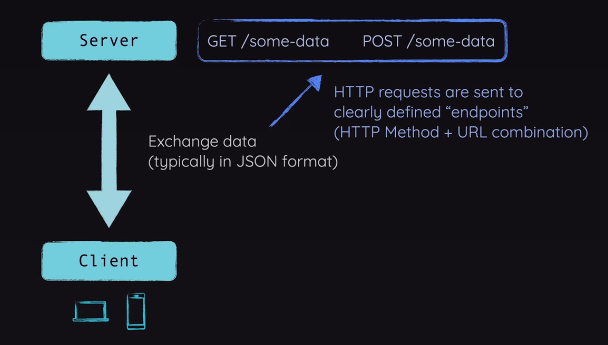
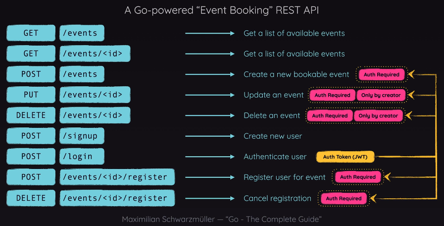

# Course Project: Build a REST API

## About

> [Go - The Complete Guide](https://www.udemy.com/course/go-the-complete-guide): (Section 11 - Course Project: Build a REST API)[https://www.udemy.com/course/go-the-complete-guide/learn/lecture/40773906#overview]

"Go - The Complete Guide," the definitive online course meticulously designed for both newcomers and professionals eager to excel in the dynamic realm of Go programming.

### Project: REST API

Building a REST API with Go.

## Planning the API

- [How does the Internet work](https://developer.mozilla.org/en-US/docs/Learn_web_development/Howto/Web_mechanics/How_does_the_Internet_work)
- [How does the Web work](https://developer.mozilla.org/en-US/docs/Learn_web_development/Getting_started/Web_standards/How_the_web_works)
- [Understanding HTTP](https://www.cloudflare.com/en-gb/learning/ddos/glossary/hypertext-transfer-protocol-http/)
- [HTTP Response Code](https://developer.mozilla.org/en-US/docs/Web/HTTP/Status)



***What's a REST API***


***Go-powered "Event Booking" REST API***

## 162: Installing the Gin framework

> [Gin Web Framework](https://github.com/gin-gonic/gin)
>
> Gin is a web framework written in Go. It features a martini-like API with performance that is up to 40 times faster thanks to httprouter. If you need performance and good productivity, you will love Gin.

```sh
mkdir restApi
cd restApi

touch main.go

go mod init restapi

go get -u github.com/gin-gonic/gin
```

- [V01.162](./restApi/_versions/v01.162/)

## 163: Setting up a first route & handling a first request

- [V02.163](./restApi/_versions/v02.163/)

```sh
go run main.go
```

## 164: Setting up an event model

```sh
mkdir models
touch models/event.go
```

- [V03.164](./restApi/_versions/v03.164/)

## 165.166: Registering a POST route & Testing requests

- [V04.165.166](./restApi/_versions/v04.165.166/)
- [VSCode REST Client](https://marketplace.visualstudio.com/items?itemName=humao.rest-client)

## 167: Initializing a Database

**In the next lecture**, we'll add & initialize (i.e., connect to) a SQL Database.

When writing the code for connecting, there's a minor mistake in the code I'll show you in the next lecture.

Instead of writing this code (in the next lecture):

```go
var DB *sql.DB
 
func InitDB() {
  DB, err := sql.Open("sqlite3", "api.db")

  if err != nil {
    panic("Could not connect to Database.")
  }

  DB.SetMaxOpenConns(10)
  DB.SetMaxIdleConns(5)

  createTables()
}
```

You should write this:

```go
var DB *sql.DB

func InitDB() {
  var err error
  DB, err = sql.Open("sqlite3", "api.db")

  if err != nil {
    panic("Could not connect to Database.")
  }

  DB.SetMaxOpenConns(10)
  DB.SetMaxIdleConns(5)

  createTables()
}
```

## 168.169: Adding a SQL Database & Creating a SQL Database table

- [sqlite3 package module](https://pkg.go.dev/github.com/mattn/go-sqlite3)
- [go-sqlite3 Github](https://github.com/mattn/go-sqlite3)

```sh
go get github.com/mattn/go-sqlite3
```

- [V05.167.168.169](./restApi/_versions/v05.167.168.169/)

```sh
go run main.go
```

## 170.171: Storing data in the Database (INSERT) & Getting events from Database (SELECT)

- [V06.170.171](./restApi/_versions/v06.170.171/)

```sh
go run main.go
```

## 172: Preparing Statements vs Directly Executing Queries (Prepare() vs Exec()/Query())

In the previous lectures, we started sending SQL commands to the SQLite database.

And we did this by following different approaches:

1. `DB.Exec()` (when we created the tables)
1. `Prepare()` + `stmt.Exec()` (when we inserted data into the database)
1. `DB.Query()` (when we fetched data from the database)

Using `Prepare()` is **100% optional**! You could send all your commands directly via `Exec()` or `Query()`.

The difference between those two methods then just is whether you're fetching data from the database (=> use `Query()`) or your manipulating the database / data in the database (=> use `Exec()`).

But what's the advantage of using Prepare()?

`Prepare()` prepares a SQL statement - this can lead to better performance if the same statement is executed multiple times (potentially with different data for its placeholders).

This is only true, if the prepared statement is not closed (`stmt.Close()`) in between those executions. In that case, there wouldn't be any advantages.

And, indeed, in this application, we are calling `stmt.Close()` directly after calling `stmt.Exec()`. So here, it really wouldn't matter which approach you're using.

But in order to show you the different ways of using the sql package, I decided to also include this preparation approach in this course.

## 173: Getting single event data by ID

- [V07.173](./restApi/_versions/v07.173/)

```sh
go run main.go
```

## 174: Refactoring code & Outsourcing routes

- [V08.174](./restApi/_versions/v08.174/)

```sh
go run main.go
```

## 175.176.177: Registering an "Update Event" & Handler & Updating Events & Deleting Events

- [V09.175.176.177](./restApi/_versions/V09.175.176.177/)

```sh
go run main.go
```

## 178.179: Adding a "Users" table to the SQL database & Adding user signup

- [V10.178.179](./restApi/_versions/v10.178.179/)

```sh
go run main.go
```

## 180.181: Don't store plain-text passwords & Hashing passwords

- [bcrypt package](https://pkg.go.dev/golang.org/x/crypto/bcrypt)

```sh
go get -u golang.org/x/crypto
```

- [V11.180.181](./restApi/_versions/v11.180.181/)

```sh
go run main.go
```

## 182.183.184: Getting started with JWT & Getting Started with & Finishing the Login logic route



***Go-powered "Event Booking" REST API - Auth required by endpoint***

- [V12.182.183.184](./restApi/_versions/v12.182.183.184/)

```sh
go run main.go
```

## 185.186: Generating JWT & Finishing the JWT logic

- [Golang JWT](https://github.com/golang-jwt/jwt)
- [V13.185.186](./restApi/_versions/v13.185.186/)

```sh
go get -u github.com/golang-jwt/jwt/v5
```

## 187.188.189: Adding token verification & Adding route protection & Retrieving and storing user and event IDs

- [V14.187.188.189](./restApi/_versions/v14.187.188.189/)

```sh
go get -u github.com/golang-jwt/jwt/v5
```

## 190

## Day 5: 190 - 197 (37min)

## That's all

...folks!!!
