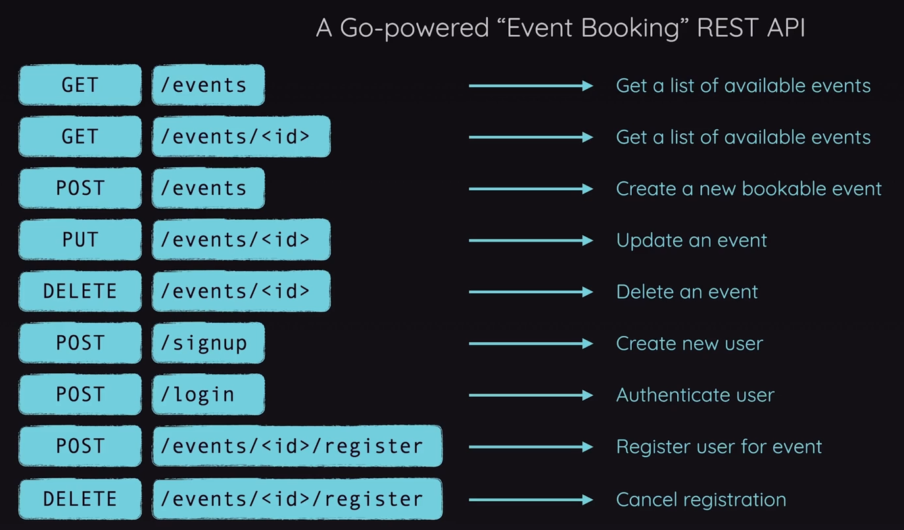

# Course Project: Build a REST API

## About

> [Go - The Complete Guide](https://www.udemy.com/course/go-the-complete-guide): (Section 11 - Course Project: Build a REST API)[https://www.udemy.com/course/go-the-complete-guide/learn/lecture/40773906#overview]

"Go - The Complete Guide," the definitive online course meticulously designed for both newcomers and professionals eager to excel in the dynamic realm of Go programming.

### Project: REST API

Building a REST API with Go.

## Planning the API

- [How does the Internet work](https://developer.mozilla.org/en-US/docs/Learn_web_development/Howto/Web_mechanics/How_does_the_Internet_work)
- [How does the Web work](https://developer.mozilla.org/en-US/docs/Learn_web_development/Getting_started/Web_standards/How_the_web_works)
- [Understanding HTTP](https://www.cloudflare.com/en-gb/learning/ddos/glossary/hypertext-transfer-protocol-http/)
- [HTTP Response Code](https://developer.mozilla.org/en-US/docs/Web/HTTP/Status)


***What's a REST API***



***Go-powered "Event Booking" REST API***

## 162: Installing the Gin framework

> [Gin Web Framework](https://github.com/gin-gonic/gin)
>
> Gin is a web framework written in Go. It features a martini-like API with performance that is up to 40 times faster thanks to httprouter. If you need performance and good productivity, you will love Gin.

```sh
mkdir restApi
cd restApi

touch main.go

go mod init restapi

go get -u github.com/gin-gonic/gin
```

- [V01.162](./restApi/_versions/v01.162/)

## 163: Setting up a first route & handling a first request

- [V02.163](./restApi/_versions/v02.163/)

```sh
go run main.go
```

## 164: Setting up an event model

```sh
mkdir models
touch models/event.go
```

- [V03.164](./restApi/_versions/v03.164/)

## 165-166: Registering a POST route & Testing requests

- [V03.165-166](./restApi/_versions/v04.165-166/)
- [VSCode REST Client](https://marketplace.visualstudio.com/items?itemName=humao.rest-client)

## 167: Initializing a database

**In the next lecture**, we'll add & initialize (i.e., connect to) a SQL database.

When writing the code for connecting, there's a minor mistake in the code I'll show you in the next lecture.

Instead of writing this code (in the next lecture):

```go
var DB *sql.DB
 
func InitDB() {
  DB, err := sql.Open("sqlite3", "api.db")

  if err != nil {
    panic("Could not connect to database.")
  }

  DB.SetMaxOpenConns(10)
  DB.SetMaxIdleConns(5)

  createTables()
}
```

You should write this:

```go
var DB *sql.DB

func InitDB() {
  var err error
  DB, err = sql.Open("sqlite3", "api.db")

  if err != nil {
    panic("Could not connect to database.")
  }

  DB.SetMaxOpenConns(10)
  DB.SetMaxIdleConns(5)

  createTables()
}
```

## Day 2: 167 - 173 (44min)

## Day 3: 174 - 182 (44min)

## Day 4: 183 - 188 (47min)

## Day 5: 189 - 197 (45min)

## That's all

...folks!!!
